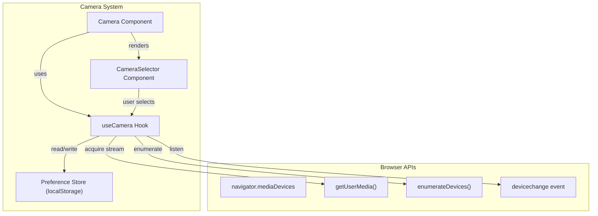
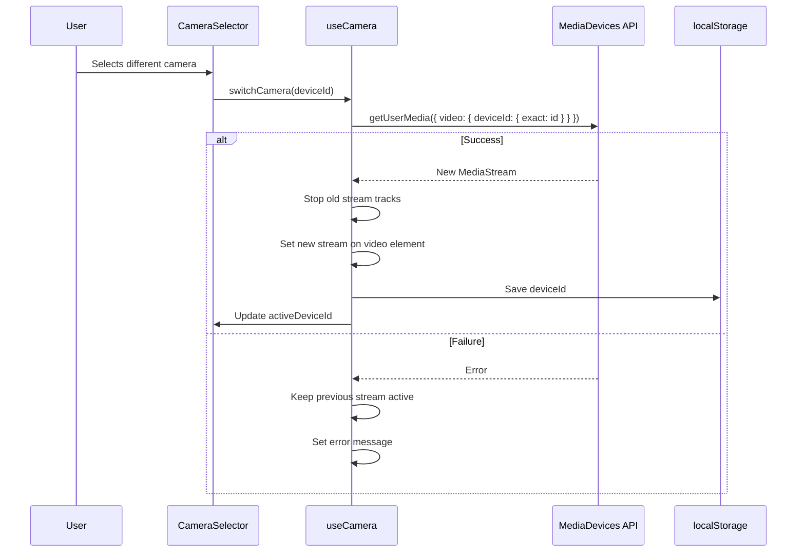

# Design Document: Camera Selection

## Overview

The Camera Selection feature extends the existing `Camera` component to support multiple video input devices. Currently, the app calls `getUserMedia({ video: true })`, which lets the browser pick a default camera. This feature adds device enumeration, a selector UI, stream switching, and preference persistence so users can choose and remember their preferred camera.

### Key Design Decisions

1. **Custom hook for device enumeration (`useCamera`)**: All camera device logic — enumeration, stream management, switching, and preference persistence — lives in a single custom hook. This keeps the `Camera` component thin and makes the logic testable in isolation.
2. **`devicechange` event for hot-plug support**: The hook listens to `navigator.mediaDevices.devicechange` to re-enumerate devices when cameras are connected or disconnected, keeping the device list current without polling.
3. **localStorage for preference persistence**: The selected `deviceId` is stored in localStorage under a dedicated key. This matches the existing pattern used by `useCollection` and avoids introducing new dependencies.
4. **Selector hidden when only one camera**: The `CameraSelector` component renders nothing when fewer than two devices are available, keeping the UI clean on single-camera devices.
5. **Graceful fallback on switch failure**: If a selected camera fails to start, the component reverts to the previous stream and shows an error. If a persisted `deviceId` no longer exists, it falls back to the default camera and clears the stale preference.

## Architecture



### Camera Switch Flow



## Components and Interfaces

### 1. `useCamera` Hook (`hooks/useCamera.ts`)

Central hook managing all camera device logic. Replaces the inline `useEffect` currently in `Camera.tsx`.

```typescript
interface CameraDevice {
  deviceId: string;
  label: string;
}

interface UseCameraReturn {
  devices: CameraDevice[];
  activeDeviceId: string | null;
  stream: MediaStream | null;
  error: string | null;
  switchCamera: (deviceId: string) => Promise<void>;
}

function useCamera(): UseCameraReturn;
```

**Responsibilities:**
- On mount: enumerate video input devices, read stored preference from localStorage, acquire initial stream
- Filter `enumerateDevices()` results to `kind === 'videoinput'`
- Generate fallback labels ("Camera 1", "Camera 2", ...) for devices with empty labels
- Listen to `devicechange` event and re-enumerate
- `switchCamera(deviceId)`: stop current stream, call `getUserMedia` with `{ deviceId: { exact: deviceId } }`, save preference
- On switch failure: keep previous stream, set error
- On mount with stale preference: fall back to default, clear stored preference
- Cleanup: stop all tracks and remove event listener on unmount

### 2. `CameraSelector` Component (`components/CameraSelector.tsx`)

Dropdown-style UI for picking a camera.

```typescript
interface CameraSelectorProps {
  devices: CameraDevice[];
  activeDeviceId: string | null;
  onSelect: (deviceId: string) => void;
}

function CameraSelector(props: CameraSelectorProps): JSX.Element | null;
```

**Responsibilities:**
- Render nothing if `devices.length <= 1`
- Render a `<select>` element with one `<option>` per device
- Highlight the active device via the `value` attribute
- Call `onSelect` on change
- Include `aria-label="Select camera"` for accessibility
- Be keyboard-operable (native `<select>` handles Tab, Enter, Space)

### 3. Updated `Camera` Component (`components/Camera.tsx`)

The existing `Camera` component is updated to use `useCamera` and render `CameraSelector`.

```typescript
const Camera = forwardRef<HTMLVideoElement>(function Camera(_props, ref) {
  const { devices, activeDeviceId, stream, error, switchCamera } = useCamera();
  // Assign stream to video ref
  // Render CameraSelector positioned in the UI
  // Render error state if error is set
  // Render video element
});
```

### 4. ARIA Live Region

When the active camera changes, an `aria-live="polite"` region announces the change to screen readers.

```tsx
<div aria-live="polite" className="sr-only">
  {announcement}
</div>
```

### 5. Camera Preference Utilities (`hooks/useCamera.ts` — internal)

Pure functions for localStorage interaction, following the same pattern as `useCollection.ts`:

```typescript
const CAMERA_PREFERENCE_KEY = 'echoes-camera-preference';

function loadCameraPreference(): string | null;
function saveCameraPreference(deviceId: string): void;
function clearCameraPreference(): void;
```

## Data Models

### CameraDevice

```typescript
interface CameraDevice {
  deviceId: string;  // MediaDeviceInfo.deviceId
  label: string;     // MediaDeviceInfo.label or fallback "Camera N"
}
```

### localStorage Schema

**Camera Preference** (`localStorage key: "echoes-camera-preference"`):
```json
"a1b2c3d4e5f6"
```

A plain string storing the selected device's `deviceId`. No JSON wrapping — just the raw ID string, matching the simplicity of the value.

### New Translation Keys

```typescript
{
  // Camera selector
  camera_select_label: 'Select camera',
  camera_switch_error: 'Failed to switch camera. Using previous camera.',
  camera_switched: 'Switched to {label}',  // for aria-live announcement
}
```


## Correctness Properties

*A property is a characteristic or behavior that should hold true across all valid executions of a system — essentially, a formal statement about what the system should do. Properties serve as the bridge between human-readable specifications and machine-verifiable correctness guarantees.*

### Property 1: Device filtering preserves only video inputs

*For any* list of `MediaDeviceInfo`-like objects with mixed `kind` values (`videoinput`, `audioinput`, `audiooutput`), the device filter function SHALL return exactly the devices where `kind === 'videoinput'`, preserving their order and losing no video input devices.

**Validates: Requirements 1.2**

### Property 2: Label generation correctness

*For any* list of video input devices, the label generation function SHALL preserve non-empty device labels unchanged and SHALL replace empty labels with `"Camera N"` where N is the 1-based index of that device in the list.

**Validates: Requirements 2.3, 2.4**

### Property 3: Camera preference persistence round-trip

*For any* non-empty `deviceId` string, saving it to the Preference_Store and then loading it back SHALL return the exact same string. Additionally, calling `clearCameraPreference` and then loading SHALL return `null`.

**Validates: Requirements 4.1**

## Error Handling

| Error Condition | Handling Strategy | User Feedback |
|----------------|-------------------|---------------|
| `enumerateDevices` unavailable or throws | Catch error, return empty device list | Camera falls back to generic `getUserMedia({ video: true })` — no selector shown |
| Camera permission denied (`NotAllowedError`) | Existing error handling in Camera component | "Camera access is required to scan objects" |
| No camera found (`NotFoundError`) | Existing error handling in Camera component | "A camera-equipped device is required" |
| Selected camera fails to start | Catch `getUserMedia` error, keep previous stream | "Failed to switch camera. Using previous camera." via error state |
| Stored preference references missing device | Detect mismatch during mount, clear preference | Silently fall back to default camera |
| `localStorage` write fails (`QuotaExceededError`) | Catch error in `saveCameraPreference` | Silently fail — preference not saved but camera still works |

## Testing Strategy

### Unit Tests (Example-Based)

**Frontend unit tests** (Vitest + React Testing Library):

- **useCamera hook:**
  - Calls `enumerateDevices` on mount and filters to videoinput
  - Reads stored preference on mount and uses it as initial device
  - Falls back to default when stored preference doesn't match any device
  - Re-enumerates on `devicechange` event
  - `switchCamera` stops old tracks and acquires new stream with exact deviceId constraint
  - `switchCamera` failure preserves previous stream and sets error
  - Cleanup stops tracks and removes event listener on unmount

- **CameraSelector component:**
  - Renders nothing when 0 or 1 device
  - Renders `<select>` with options when 2+ devices
  - Shows active device as selected value
  - Calls `onSelect` with deviceId on change
  - Has `aria-label="Select camera"`
  - Renders fallback "Camera N" labels for devices with empty labels

- **Camera component (updated):**
  - Renders CameraSelector when multiple devices available
  - Hides CameraSelector when single device
  - ARIA live region announces camera switch

- **Preference utilities:**
  - `saveCameraPreference` writes to localStorage
  - `loadCameraPreference` reads from localStorage
  - `clearCameraPreference` removes from localStorage
  - Handles missing key gracefully (returns null)

### Property-Based Tests

Property-based tests verify universal correctness properties across many generated inputs. Each test runs a minimum of 100 iterations.

**Library**: `fast-check` (already installed in the project)

| Property | Test Description | Min Iterations |
|----------|-----------------|---------------|
| Property 1: Device filtering | Generate random arrays of device objects with mixed `kind` values → apply filter → verify only `videoinput` devices remain and none are lost | 100 |
| Property 2: Label generation | Generate random arrays of `{ deviceId, label }` objects where some labels are empty → apply label generation → verify non-empty labels preserved, empty labels become "Camera N" | 100 |
| Property 3: Preference round-trip | Generate random non-empty strings → save to mock localStorage → load back → verify equality; also test clear then load returns null | 100 |

**Tagging format**: Each property test includes a comment:
```
// Feature: camera-selection, Property {N}: {property title}
```

### Integration Tests

- Mount `Camera` component with mocked `enumerateDevices` returning 2+ devices, verify selector appears and switching works end-to-end
- Verify `devicechange` event triggers re-enumeration and UI update

### Smoke Tests

- Translation keys `camera_select_label`, `camera_switch_error`, `camera_switched` exist in the translation store
