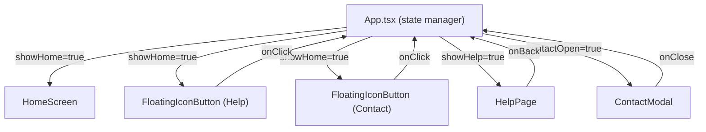
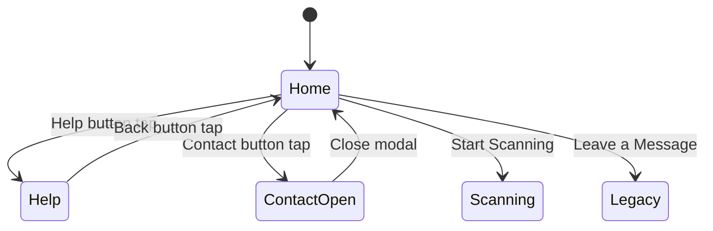

# Design Document: Help & Contact Icons

## Overview

This feature adds two floating icon buttons (Help and Contact) to the Home Screen, a dedicated Help page, and a Contact modal. The implementation follows the existing state-based navigation pattern in `App.tsx` — no router library is introduced. New components are additive: the existing `HomeScreen`, `App`, and all other components remain untouched.

### Key Design Decisions

1. **State-based navigation over routing**: The app already uses `useState` flags in `App.tsx` to switch between views (home, collection, legacy). The Help page follows the same pattern with a `showHelp` flag rather than introducing `react-router`. This keeps the architecture consistent and avoids a new dependency.

2. **FloatingIconButton as a shared primitive**: A single reusable component handles the circular glass-effect button styling, positioning (left/right), and interaction animations. Both the Help and Contact buttons on the Home Screen, and the back button on the Help page, use this component.

3. **ContactModal manages its own focus trap**: The modal implements focus trapping, Escape-to-close, and backdrop-click-to-close internally, using standard DOM APIs. No modal library is added.

4. **Non-destructive integration**: The floating buttons are rendered as siblings alongside the existing `HomeScreen` content in `App.tsx`. The `HomeScreen` component itself is not modified.

## Architecture



### Navigation State Machine



The `App` component manages these states:

| State | `showHome` | `showHelp` | `contactOpen` |
|-------|-----------|-----------|---------------|
| Home Screen | `true` | `false` | `false` |
| Help Page | `false` | `true` | `false` |
| Contact Modal (over Home) | `true` | `false` | `true` |

When `contactOpen` is `true`, the Home Screen remains mounted behind the modal backdrop, and the floating buttons stay visible but non-interactive behind the overlay.

## Components and Interfaces

### FloatingIconButton

**File**: `frontend/src/components/FloatingIconButton.tsx`

A reusable circular button with glass effect, neon glow, and fixed positioning.

```typescript
interface FloatingIconButtonProps {
  /** The lucide-react icon element to render inside the button */
  icon: React.ReactNode;
  /** Click handler */
  onClick: () => void;
  /** Fixed position: bottom-left or bottom-right of the viewport */
  position: 'left' | 'right';
  /** Accessible label for screen readers */
  ariaLabel: string;
  /** Optional additional CSS classes */
  className?: string;
}
```

**Visual specs**:
- Diameter: 48px (meets 44px minimum touch target)
- Background: `rgba(0, 0, 0, 0.4)` with `backdrop-filter: blur(12px)`
- Border: `1px solid` using `--color-border-glow` (rgba(0, 230, 184, 0.3))
- Box-shadow: `--shadow-glow-sm` (0 0 10px rgba(0, 230, 184, 0.2))
- Hover/active shadow: `--shadow-glow-md` (0 0 20px rgba(0, 230, 184, 0.3))
- Active scale: `scale(0.95)`
- Transition: `150ms ease` on transform, box-shadow
- Icon color: `--color-primary-400` (#1affa3), size: 22px
- Position offset: 24px from bottom, 24px from left/right edge
- z-index: 40 (above background layers, below modals at z-50)

### HelpPage

**File**: `frontend/src/components/HelpPage.tsx`

A full-screen view displaying informational content in glass-styled cards.

```typescript
interface HelpPageProps {
  /** Callback to navigate back to the Home Screen */
  onBack: () => void;
}
```

**Sections**: "What is this", "How to use", "Legacy Mode", "Tips"

Each section is rendered inside a glass card:
- Background: `--color-background-card` with opacity
- Backdrop blur: 12px
- Border: `1px solid --color-border`
- Border-radius: 12px
- Heading color: `--color-primary-400`

The back button in the top-left uses `FloatingIconButton` with `position="left"` and an `ArrowLeft` icon from lucide-react. The page is scrollable (`overflow-y: auto`) with padding to avoid overlap with the back button.

### ContactModal

**File**: `frontend/src/components/ContactModal.tsx`

A centered overlay dialog showing contact information.

```typescript
interface ContactModalProps {
  /** Whether the modal is currently open */
  isOpen: boolean;
  /** Callback to close the modal */
  onClose: () => void;
}
```

**Content**:
- Title: "Contact" (`<h2>` with `id` for `aria-labelledby`)
- Name: "Oscar Navas"
- Company: "Navium"
- Email: "on.navas@gmail.com" as `<a href="mailto:on.navas@gmail.com">` styled in `--color-primary-400`
- Close button: top-right corner, `X` icon from lucide-react

**Accessibility**:
- `role="dialog"`, `aria-modal="true"`, `aria-labelledby="contact-modal-title"`
- Focus trap: Tab/Shift+Tab cycles within modal content
- On open: focus moves to close button
- On close: focus returns to the Contact button trigger
- Escape key closes the modal

**Animation**:
- Open: fade in (opacity 0→1) + scale (0.95→1), 200ms ease
- Close: reverse animation
- Backdrop: `rgba(0, 0, 0, 0.6)` with backdrop-filter blur

**Responsive**:
- Max-width: 90vw on mobile, 400px on larger screens
- Glass card styling matching the app theme

### App.tsx Integration

The `App` component gains two new state variables:

```typescript
const [showHelp, setShowHelp] = useState(false);
const [contactOpen, setContactOpen] = useState(false);
```

When `showHome` is `true`, the floating buttons render alongside `HomeScreen`. When the Help button is clicked, `showHome` becomes `false` and `showHelp` becomes `true`. The Contact button sets `contactOpen` to `true` while keeping `showHome` as `true`.

## Data Models

This feature introduces no persistent data models, API calls, or storage. All state is ephemeral UI state managed via React `useState`.

### UI State

| State Variable | Type | Default | Description |
|---------------|------|---------|-------------|
| `showHelp` | `boolean` | `false` | Whether the Help page is displayed |
| `contactOpen` | `boolean` | `false` | Whether the Contact modal is open |

### Component Props (TypeScript interfaces)

```typescript
// FloatingIconButton
interface FloatingIconButtonProps {
  icon: React.ReactNode;
  onClick: () => void;
  position: 'left' | 'right';
  ariaLabel: string;
  className?: string;
}

// HelpPage
interface HelpPageProps {
  onBack: () => void;
}

// ContactModal
interface ContactModalProps {
  isOpen: boolean;
  onClose: () => void;
}
```


## Correctness Properties

*A property is a characteristic or behavior that should hold true across all valid executions of a system — essentially, a formal statement about what the system should do. Properties serve as the bridge between human-readable specifications and machine-verifiable correctness guarantees.*

After analyzing all 40+ acceptance criteria across 12 requirements, the vast majority are UI rendering checks, specific content verification, CSS styling assertions, and interaction tests with fixed inputs. These are best covered by example-based unit tests.

One property was identified as suitable for property-based testing:

### Property 1: Aria-label passthrough

*For any* string passed as the `ariaLabel` prop to `FloatingIconButton`, the rendered `<button>` element's `aria-label` attribute SHALL equal that exact string.

**Validates: Requirements 4.4**

This property ensures the accessibility label is faithfully passed through for any input — including empty strings, strings with special characters, Unicode, and very long strings. The project already has `fast-check` installed, making this a low-cost addition that validates accessibility correctness across the full input space.

## Error Handling

### FloatingIconButton
- No error states. The component is purely presentational. If `icon` is `null` or `undefined`, the button renders empty (no crash). The `onClick` handler is called directly — errors in the handler propagate to the caller.

### HelpPage
- No error states. Content is static. The `onBack` callback is called directly on button click.

### ContactModal
- **Focus trap edge case**: If the modal contains no focusable elements (shouldn't happen in practice since the close button is always present), the focus trap gracefully does nothing rather than throwing.
- **Escape key listener**: The `keydown` listener is added on mount and cleaned up on unmount to prevent memory leaks.
- **Backdrop click**: The click handler uses `e.target === e.currentTarget` to distinguish backdrop clicks from clicks inside the modal content, preventing accidental closes.

### Navigation State
- Invalid state combinations (e.g., `showHome=true` and `showHelp=true` simultaneously) are prevented by the state transition logic in `App.tsx`, which always sets mutually exclusive flags together.

## Testing Strategy

### Testing Approach

This feature uses a dual testing approach:

1. **Example-based unit tests** (primary): Cover specific rendering, content, interactions, accessibility attributes, and CSS styling for all components.
2. **Property-based tests** (supplementary): Validate the aria-label passthrough property using `fast-check` with 100+ iterations.

### Test Files

| Component | Test File | Type |
|-----------|-----------|------|
| FloatingIconButton | `FloatingIconButton.test.tsx` | Unit (example-based) |
| FloatingIconButton | `FloatingIconButton.property.test.tsx` | Property-based |
| HelpPage | `HelpPage.test.tsx` | Unit (example-based) |
| ContactModal | `ContactModal.test.tsx` | Unit (example-based) |
| App (integration) | `App.test.tsx` (extend existing or new) | Unit (example-based) |

### Unit Test Coverage

**FloatingIconButton** (`FloatingIconButton.test.tsx`):
- Renders a `<button>` element with the provided icon
- Applies `position: fixed` styling
- Renders at bottom-left when `position="left"`
- Renders at bottom-right when `position="right"`
- Applies glass effect classes (backdrop-blur, semi-transparent bg, border)
- Applies neon glow shadow class
- Has `active:scale-95` class for tap animation
- Calls `onClick` when clicked
- Calls `onClick` on Enter and Space key press
- Renders with the provided `aria-label`
- Has no visible text content (icon-only)

**HelpPage** (`HelpPage.test.tsx`):
- Renders all four content sections: "What is this", "How to use", "Legacy Mode", "Tips"
- Each section is inside a glass-styled card
- Renders a back button with ArrowLeft icon
- Calls `onBack` when back button is clicked
- Page container has `overflow-y: auto` for scrollability
- Uses dark background and neon green accent colors

**ContactModal** (`ContactModal.test.tsx`):
- Does not render when `isOpen` is `false`
- Renders when `isOpen` is `true`
- Displays "Contact" heading
- Displays "Oscar Navas"
- Displays "Navium"
- Displays email as a `mailto:` link with correct href
- Email link uses neon green color
- Has `role="dialog"`, `aria-modal="true"`, `aria-labelledby`
- Close button with X icon is present
- Calls `onClose` when close button is clicked
- Calls `onClose` when backdrop is clicked
- Calls `onClose` when Escape key is pressed
- Does not call `onClose` when clicking inside modal content
- Glass effect styling on modal container
- Max-width constraint for responsive layout

### Property-Based Test

**FloatingIconButton** (`FloatingIconButton.property.test.tsx`):

```typescript
// Feature: help-contact-icons, Property 1: Aria-label passthrough
// For any string passed as ariaLabel, the rendered button's
// aria-label attribute SHALL equal that exact string.
```

- Library: `fast-check` (already installed)
- Iterations: 100 minimum
- Generator: `fc.string()` for arbitrary strings
- Assertion: `screen.getByRole('button').getAttribute('aria-label') === ariaLabel`

### What Is NOT Tested

- Visual pixel-perfect rendering (requires visual regression tools)
- Animation smoothness and timing (CSS animation behavior)
- Actual z-index stacking in a real browser (requires E2E tests)
- Focus trap cycling with real Tab key navigation (jsdom limitations — would need E2E)
- Mobile touch target physical size (requires device testing)
