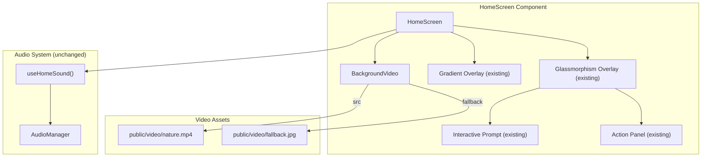

# Design Document: Home Background Video

## Overview

This feature adds an immersive, looping background video layer to the Home Screen of the "Last Message: Echoes from the Future" application. The video renders as the bottommost visual layer behind all existing UI elements, treated with opacity reduction, blur, dark overlays, and an optional green/cyan tint to produce a subtle, dreamlike atmospheric effect consistent with the dark sci-fi aesthetic.

A new `BackgroundVideo` React component encapsulates all video rendering, fallback handling, and visual treatment. It is inserted into the existing `HomeScreen` component as a self-contained layer that does not modify any existing elements, styles, or state management.

### Key Design Decisions

- **Dedicated `BackgroundVideo` component** rather than inline video markup in `HomeScreen`. This keeps the video logic (playback, fallback, error handling, cleanup) isolated and testable without touching the existing HomeScreen state machine or layout.
- **CSS-only visual treatment** (opacity, filter, overlay divs) rather than canvas-based post-processing. CSS filters and overlays are GPU-accelerated on modern browsers and mobile devices, keeping the implementation simple and performant.
- **`poster` attribute + `onError` fallback** rather than a separate feature-detection library. The `<video>` element's native `poster` attribute provides an immediate static image while the video loads, and the `onError` event handles playback failures. This avoids adding dependencies.
- **`prefers-reduced-motion` media query** as the performance escape hatch. Rather than implementing complex device capability detection, the component respects the user's OS-level motion preference to skip video loading on devices where the user has opted out of animations. This also serves as the mechanism for limited-performance devices (Requirement 6.5).
- **No modifications to `index.css` or App.tsx**. The component uses inline styles and Tailwind classes for all visual treatment. The existing gradient background in HomeScreen is replaced by the video layer, but the glassmorphism overlay and all interactive elements remain untouched.

## Architecture



### Visual Layer Stack (bottom to top)

```
┌─────────────────────────────────────────┐
│  Layer 0: BackgroundVideo               │  ← <video> or  fallback
│           opacity: 0.4, filter: blur(4px)│     absolute, inset-0, z-0
├─────────────────────────────────────────┤
│  Layer 1: Dark Overlay                  │  ← rgba(0,0,0,0.6) + backdrop-blur(4px)
│           (inside BackgroundVideo)      │     absolute, inset-0, z-[1]
├─────────────────────────────────────────┤
│  Layer 2: Tint Overlay (optional)       │  ← green/cyan tint, opacity: 0.12
│           (inside BackgroundVideo)      │     absolute, inset-0, z-[2]
├─────────────────────────────────────────┤
│  Layer 3: Existing Gradient Background  │  ← animated gradient (existing)
│           (HomeScreen)                  │     absolute, inset-0, z-[3]
│           opacity reduced to ~0.3       │     blends with video underneath
├─────────────────────────────────────────┤
│  Layer 4: Glassmorphism Overlay         │  ← existing card with blur
│           (HomeScreen)                  │     relative, z-10
├─────────────────────────────────────────┤
│  Layer 5: Title, Prompt, Action Panel   │  ← existing interactive elements
│           (inside Glassmorphism)        │     inherits z-10
└─────────────────────────────────────────┘
```

### Data Flow

1. **HomeScreen mounts** → `BackgroundVideo` renders with `src="/video/nature.mp4"` and `fallback="/video/fallback.jpg"`
2. **Video loads** → `<video>` begins autoplay (muted, looped, playsInline) → visual treatment layers render on top
3. **Video fails** → `onError` handler fires → component switches to `` fallback with identical visual treatment
4. **`prefers-reduced-motion: reduce`** → component skips video entirely, renders fallback image
5. **HomeScreen enters `exiting` phase** → existing fade+blur transition on the HomeScreen container applies to all children including BackgroundVideo — no special handling needed
6. **HomeScreen unmounts** → `BackgroundVideo` unmounts → `useEffect` cleanup pauses video and removes `src` to release resources

## Components and Interfaces

### BackgroundVideo Component

**File:** `frontend/src/components/BackgroundVideo.tsx`

```typescript
export interface BackgroundVideoProps {
  /** Path to the video file */
  src: string;
  /** Path to the fallback image */
  fallbackSrc: string;
  /** Video opacity (0-1). Default: 0.4 */
  opacity?: number;
  /** CSS blur in pixels applied to the video. Default: 4 */
  blurPx?: number;
  /** Dark overlay RGBA string. Default: 'rgba(0, 0, 0, 0.6)' */
  overlayColor?: string;
  /** Backdrop blur in pixels for the overlay. Default: 4 */
  overlayBlurPx?: number;
  /** Enable green/cyan tint overlay. Default: true */
  tintEnabled?: boolean;
  /** Tint overlay opacity (0-1). Default: 0.12 */
  tintOpacity?: number;
}

export function BackgroundVideo({
  src,
  fallbackSrc,
  opacity = 0.4,
  blurPx = 4,
  overlayColor = 'rgba(0, 0, 0, 0.6)',
  overlayBlurPx = 4,
  tintEnabled = true,
  tintOpacity = 0.12,
}: BackgroundVideoProps): JSX.Element;
```

**Internal state:**
- `videoFailed: boolean` — tracks whether the video element encountered an error, triggering fallback rendering.

**Behavior:**
- Renders a `<video>` element with `autoPlay`, `muted`, `loop`, `playsInline` attributes and `poster={fallbackSrc}`.
- On `onError` event, sets `videoFailed = true` and renders an `` element with `fallbackSrc` instead.
- Uses a `useEffect` cleanup to pause the video and set `src = ''` on unmount, releasing playback resources.
- Checks `window.matchMedia('(prefers-reduced-motion: reduce)')` on mount. If matched, skips video and renders fallback image directly.
- All visual treatment (opacity, blur, overlays) is applied identically to both video and fallback image.
- The component renders no interactive elements and sets `pointer-events: none` on its container to avoid intercepting clicks.

**Rendered structure:**
```html
<div data-testid="background-video" style="position:absolute; inset:0; z-index:0; pointer-events:none; overflow:hidden;">
  <!-- Video or fallback image -->
  <video | img style="width:100%; height:100%; object-fit:cover; opacity:{opacity}; filter:blur({blurPx}px);" />
  
  <!-- Dark overlay -->
  <div style="position:absolute; inset:0; background:{overlayColor}; backdrop-filter:blur({overlayBlurPx}px);" />
  
  <!-- Tint overlay (conditional) -->
  <div style="position:absolute; inset:0; background:linear-gradient(...teal/primary...); opacity:{tintOpacity};" />
</div>
```

### HomeScreen Integration

**Modified file:** `frontend/src/components/HomeScreen.tsx`

Changes:
- Import `BackgroundVideo` component.
- Insert `<BackgroundVideo src="/video/nature.mp4" fallbackSrc="/video/fallback.jpg" />` as the first child inside the root `<div>`, before the existing gradient background div.
- Reduce the existing gradient background div's opacity to ~0.3 so the video shows through while preserving the gradient's color contribution.
- No changes to the state machine, props interface, event handlers, or any other existing elements.

```typescript
// Inside HomeScreen's return JSX — only the new line and one opacity change:
<div data-testid="home-screen" className="fixed inset-0 z-50 flex items-center justify-center" ...>
  {/* NEW: Background video layer */}
  <BackgroundVideo src="/video/nature.mp4" fallbackSrc="/video/fallback.jpg" />

  {/* EXISTING: Animated gradient background — opacity reduced */}
  <div className="absolute inset-0" style={{ ...existingGradient, opacity: 0.3 }} />

  {/* EXISTING: Glassmorphism overlay — unchanged */}
  <div className="relative z-10 ...">
    {/* Title, prompt, action panel — all unchanged */}
  </div>
</div>
```

## Data Models

### BackgroundVideoProps (Component Configuration)

```typescript
interface BackgroundVideoProps {
  src: string;           // Video file path
  fallbackSrc: string;   // Fallback image path
  opacity?: number;      // 0.3–0.5, default 0.4
  blurPx?: number;       // Pixels, default 4
  overlayColor?: string; // RGBA string, default 'rgba(0, 0, 0, 0.6)'
  overlayBlurPx?: number;// Pixels, default 4
  tintEnabled?: boolean; // Default true
  tintOpacity?: number;  // 0–0.15, default 0.12
}
```

All configuration is passed as props — no runtime data storage, no persistence, no external state. The component is fully controlled by its parent.

### Video Element State (Internal)

```typescript
// Internal to BackgroundVideo — not exposed
videoFailed: boolean;           // Whether video playback failed
prefersReducedMotion: boolean;  // Whether user prefers reduced motion
videoRef: RefObject<HTMLVideoElement>; // Ref for cleanup on unmount
```

No new global state, context, or data stores are introduced. The existing HomeScreen state machine (`HomeScreenPhase`) is unchanged.

## Correctness Properties

*A property is a characteristic or behavior that should hold true across all valid executions of a system — essentially, a formal statement about what the system should do. Properties serve as the bridge between human-readable specifications and machine-verifiable correctness guarantees.*

### Property 1: Visual treatment prop fidelity

*For any* valid combination of `opacity` (number 0–1), `blurPx` (non-negative number), `overlayColor` (RGBA string), `overlayBlurPx` (non-negative number), `tintEnabled` (boolean), and `tintOpacity` (number 0–0.15) props, the rendered `BackgroundVideo` component SHALL apply those exact values to the corresponding DOM elements' inline styles — specifically, the media element's `opacity` and `filter: blur()`, the overlay's `background` and `backdrop-filter`, and the tint layer's `opacity` and presence/absence.

**Validates: Requirements 3.1, 3.2, 3.3, 3.4, 4.1**

### Property 2: Fallback visual treatment equivalence

*For any* set of visual treatment props (`opacity`, `blurPx`, `overlayColor`, `overlayBlurPx`, `tintEnabled`, `tintOpacity`), when the video element fires an error event and the fallback image is displayed, the visual treatment styles applied to the fallback image and its overlay layers SHALL be identical to those that would be applied to the video element — same opacity, same blur filter, same dark overlay, same tint overlay.

**Validates: Requirements 5.1, 5.3, 5.4**

## Error Handling

| Error Scenario | Handling Strategy |
|---|---|
| Video fails to load (network error, 404) | `onError` handler sets `videoFailed = true`, component renders `` fallback with identical visual treatment. No error thrown to parent. |
| Browser doesn't support `<video>` or MP4 | Same as load failure — the `onError` event fires, fallback image renders. The `poster` attribute provides an immediate static frame during the attempt. |
| Video autoplay blocked by browser policy | Since the video is `muted`, autoplay is allowed on all modern browsers (muted autoplay is universally supported). If it still fails, the `poster` image is visible as a static fallback. |
| `prefers-reduced-motion: reduce` is active | Component skips video entirely and renders fallback image directly. No video element is created. |
| Component unmounts during video loading | `useEffect` cleanup pauses the video and clears `src`, preventing background network requests and memory leaks. |
| Invalid prop values (negative blur, opacity > 1) | Props are applied as-is to CSS — the browser clamps or ignores invalid values gracefully. No runtime validation needed for CSS properties. |

## Testing Strategy

### Unit Tests (Example-Based)

Unit tests cover specific rendering and behavior scenarios using Vitest and React Testing Library:

- **BackgroundVideo rendering**: Verify video element renders with `autoplay`, `muted`, `loop`, `playsInline` attributes and correct `src`.
- **Visual treatment defaults**: Verify default opacity (0.4), blur (4px), overlay color, and tint are applied.
- **Fallback on error**: Fire `onError` on the video element, verify it switches to an `` with the fallback src.
- **Reduced motion**: Mock `matchMedia` to return `prefers-reduced-motion: reduce`, verify fallback image renders instead of video.
- **Cleanup on unmount**: Verify `pause()` is called and `src` is cleared when the component unmounts.
- **Pointer events disabled**: Verify the container has `pointer-events: none`.
- **Tint overlay conditional**: Verify tint overlay renders when `tintEnabled=true` and does not render when `tintEnabled=false`.
- **HomeScreen integration**: Verify existing HomeScreen elements (title, prompt, action panel) still render correctly with BackgroundVideo present.
- **Non-blocking render**: Verify HomeScreen UI elements are present immediately on render (video loading doesn't block them).

### Property-Based Tests (fast-check)

The project uses `fast-check` (already installed). Property tests validate universal invariants:

- **Property 1 test**: Generate random combinations of `opacity` (0–1), `blurPx` (0–20), `overlayBlurPx` (0–20), `tintEnabled` (boolean), and `tintOpacity` (0–0.15). Render `BackgroundVideo` with these props and assert the rendered DOM elements have the exact corresponding style values.
  - Minimum 100 iterations.
  - Tag: **Feature: home-background-video, Property 1: Visual treatment prop fidelity**

- **Property 2 test**: Generate random combinations of visual treatment props. Render `BackgroundVideo` in normal mode, collect the styles. Then render with a video error (triggering fallback), collect the styles. Assert the visual treatment styles are identical between both renders.
  - Minimum 100 iterations.
  - Tag: **Feature: home-background-video, Property 2: Fallback visual treatment equivalence**

### Test Configuration

- Framework: **Vitest** (already configured)
- PBT library: **fast-check** (already installed, v4.7.0)
- Each property test: minimum **100 iterations** (`fc.configureGlobal({ numRuns: 100 })`)
- Video element mocking: Mock `HTMLVideoElement` with `play()`, `pause()`, `poster`, `src` properties
- Media query mocking: Mock `window.matchMedia` for `prefers-reduced-motion` tests
