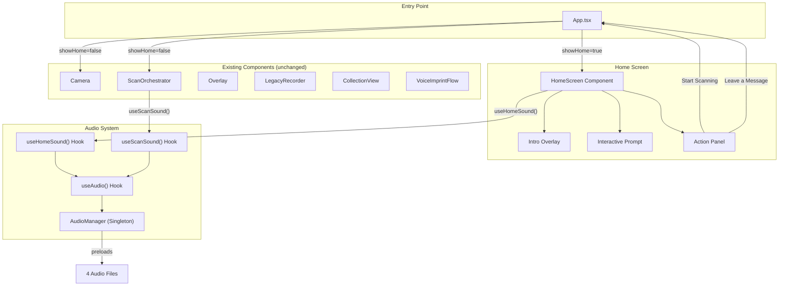
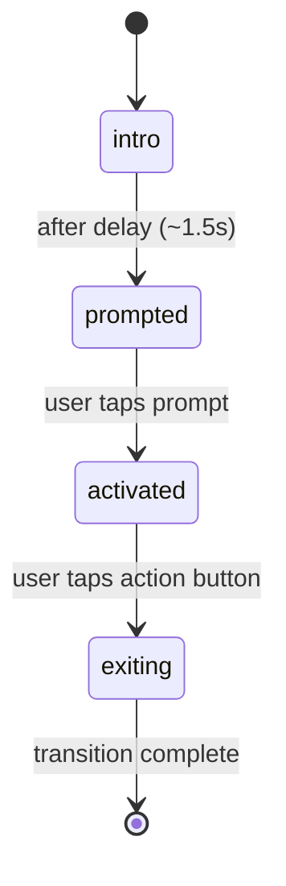

# Design Document: Interactive Home Sound System

## Overview

This feature adds two interconnected systems to the "Last Message: Echoes from the Future" application:

1. **Audio Manager** — A singleton class that preloads 4 predefined audio files, manages play/stop/loop operations, prevents overlapping non-ambient sounds, and initializes only after user interaction (complying with mobile autoplay restrictions).

2. **Interactive Home Screen** — A fullscreen entry screen with an animated intro overlay, interactive prompt, action panel, glassmorphism styling, and glitch effects that serves as the application's new entry point.

The design extends the existing UI without replacing any current screens. The Home Screen gates access to the Scan Screen and Legacy Mode, while the Audio Manager provides context-aware sounds (ambient, scanning, analyzing, reveal) throughout the app.

### Key Design Decisions

- **Singleton AudioManager class** over React context for the core audio engine. This keeps audio state outside React's render cycle, avoids re-renders on audio state changes, and allows the same instance to be shared across hooks. React hooks (`useAudio`, `useHomeSound`, `useScanSound`) wrap the singleton for component integration.
- **New `showHome` state in App.tsx** rather than a router. The app already uses boolean states (`showCollection`, `showLegacy`) for view switching. Adding `showHome` follows the same pattern and avoids introducing a routing dependency.
- **Preload via `HTMLAudioElement`** rather than `AudioContext` / Web Audio API. The existing `useAudioPlayer` hook uses `HTMLAudioElement`, and the 4 UI sound files are small enough that simple preloading is sufficient. This keeps the implementation consistent and simple.

## Architecture



### Data Flow

1. **App loads** → `showHome = true` → HomeScreen renders
2. **User taps prompt** → AudioManager initializes → ambient sound starts looping → Action Panel reveals
3. **User taps "Start Scanning"** → `showHome = false` → ambient stops → Camera + ScanOrchestrator render
4. **User presses Scan** → `useScanSound().playScan()` → scanning.wav plays once
5. **Scan processing starts** → `useScanSound().startAnalyzing()` → analizing.wav loops
6. **Result ready** → `useScanSound().playReveal()` → analizing.wav stops → 200-300ms delay → reveal.wav plays once

## Components and Interfaces

### AudioManager (Singleton Class)

**File:** `frontend/src/audio/AudioManager.ts`

```typescript
// Sound identifiers for the 4 predefined audio files
type SoundId = 'ambient' | 'scan' | 'analyzing' | 'reveal';

// Map of sound IDs to their file paths
const SOUND_REGISTRY: Record<SoundId, string> = {
  ambient: '/audio/Futuristic_Ambience.mp3',
  scan: '/audio/scanning.wav',
  analyzing: '/audio/analizing.wav',
  reveal: '/audio/reveal.wav',
};

class AudioManager {
  private static instance: AudioManager | null = null;
  private sounds: Map<SoundId, HTMLAudioElement>;
  private initialized: boolean;
  private currentNonAmbient: SoundId | null;

  private constructor();

  /** Get or create the singleton instance */
  static getInstance(): AudioManager;

  /** Initialize audio after first user interaction. Preloads all 4 files. */
  init(): void;

  /** Play a sound. Options: loop (boolean), volume (number 0-1) */
  play(id: SoundId, options?: { loop?: boolean; volume?: number }): void;

  /** Stop a specific sound */
  stop(id: SoundId): void;

  /** Stop all currently playing sounds */
  stopAll(): void;

  /** Check if a specific sound is currently playing */
  isPlaying(id: SoundId): boolean;

  /** Check if the manager has been initialized */
  isInitialized(): boolean;
}
```

**Behavior rules:**
- `play()` for a non-ambient sound stops any other currently playing non-ambient sound first (prevents overlapping).
- `play()` for ambient does not stop non-ambient sounds (ambient runs concurrently).
- `play('scan')` while scan is already playing restarts it from `currentTime = 0`.
- `play()` before `init()` is a no-op (graceful degradation).
- All errors from `HTMLAudioElement.play()` are caught and logged — never thrown to callers.

### useAudio() Hook

**File:** `frontend/src/hooks/useAudio.ts`

```typescript
interface UseAudioReturn {
  play: (id: SoundId, options?: { loop?: boolean; volume?: number }) => void;
  stop: (id: SoundId) => void;
  stopAll: () => void;
  isPlaying: (id: SoundId) => boolean;
  init: () => void;
  initialized: boolean;
}

function useAudio(): UseAudioReturn;
```

Thin wrapper around `AudioManager.getInstance()`. Exposes the singleton's methods as a hook interface. Uses `useSyncExternalStore` or a simple ref to track `initialized` state.

### useHomeSound() Hook

**File:** `frontend/src/hooks/useHomeSound.ts`

```typescript
interface UseHomeSoundReturn {
  startAmbient: () => void;
  stopAmbient: () => void;
}

function useHomeSound(): UseHomeSoundReturn;
```

- Calls `useAudio()` internally.
- `startAmbient()` plays ambient sound in a loop at volume 0.25.
- `stopAmbient()` stops the ambient sound.
- On unmount, automatically stops ambient (cleanup via `useEffect` return).

### useScanSound() Hook

**File:** `frontend/src/hooks/useScanSound.ts`

```typescript
interface UseScanSoundReturn {
  playScan: () => void;
  startAnalyzing: () => void;
  stopAnalyzing: () => void;
  playReveal: () => void;
}

function useScanSound(): UseScanSoundReturn;
```

- Calls `useAudio()` internally.
- `playScan()` plays scanning.wav once.
- `startAnalyzing()` plays analizing.wav in a loop.
- `stopAnalyzing()` stops analizing.wav.
- `playReveal()` stops analyzing sound, then plays reveal.wav once after a 200-300ms delay (using `setTimeout`).

### HomeScreen Component

**File:** `frontend/src/components/HomeScreen.tsx`

```typescript
interface HomeScreenProps {
  onStartScanning: () => void;
  onLeaveMessage: () => void;
}

function HomeScreen({ onStartScanning, onLeaveMessage }: HomeScreenProps): JSX.Element;
```

**Internal state machine:**



- **`intro`** — Title + subtitle visible, prompt hidden.
- **`prompted`** — Prompt fades in ("Tap to initialize connection").
- **`activated`** — AudioManager initializes, ambient starts, glitch effect plays, Action Panel reveals.
- **`exiting`** — Fade + blur transition, ambient stops, callback fires.

**Visual structure:**

```
┌─────────────────────────────────┐
│  Animated Background            │
│  (gradient + blur)              │
│                                 │
│  ┌───────────────────────────┐  │
│  │  Glassmorphism Overlay    │  │
│  │                           │  │
│  │  LAST MESSAGE             │  │
│  │  Echoes from the future   │  │
│  │  are still around you     │  │
│  │                           │  │
│  │  [Tap to initialize]     │  │
│  │                           │  │
│  │  ┌─────────────────────┐  │  │
│  │  │ Start Scanning      │  │  │
│  │  │ Leave a Message     │  │  │
│  │  └─────────────────────┘  │  │
│  └───────────────────────────┘  │
│                                 │
└─────────────────────────────────┘
```

**Styling:**
- Background: CSS gradient animation with subtle movement (uses existing `--color-background`, `--color-primary-*` tokens).
- Overlay: `backdrop-filter: blur(16px)` + semi-transparent background (glassmorphism).
- Buttons: `rounded-full` pill shape with `shadow-glow-sm` (reuses existing Tailwind theme).
- Glitch: Reuses existing `.animate-glitch` keyframes from `index.css`.
- All transitions: CSS `opacity` and `filter: blur()` with `transition-all duration-500`.

### App.tsx Integration

**Modified file:** `frontend/src/App.tsx`

Changes:
- Add `showHome` state, initialized to `true`.
- When `showHome` is true, render `<HomeScreen>` instead of Camera/ScanOrchestrator/nav buttons.
- `onStartScanning` callback sets `showHome = false`.
- `onLeaveMessage` callback sets `showHome = false` and `showLegacy = true`.
- Add a "Home" button to the existing nav bar (visible when `showHome` is false) to return to the Home Screen.

```typescript
// Pseudocode for the new App state flow
const [showHome, setShowHome] = useState(true);

// When on Home Screen: only HomeScreen renders
// When not on Home Screen: existing Camera + ScanOrchestrator + nav renders as before
```

### ScanOrchestrator Integration

**Modified file:** `frontend/src/components/ScanOrchestrator.tsx`

Changes:
- Import and call `useScanSound()`.
- In `handleScan`:
  - Call `playScan()` when scan starts.
  - Call `startAnalyzing()` when waiting for API response.
  - Call `stopAnalyzing()` + `playReveal()` when result arrives.
- The existing `playAudio()` function for message audio remains unchanged — it handles category message playback, which is separate from UI sounds.

## Data Models

### Sound Registry (Static Configuration)

```typescript
type SoundId = 'ambient' | 'scan' | 'analyzing' | 'reveal';

const SOUND_REGISTRY: Record<SoundId, string> = {
  ambient: '/audio/Futuristic_Ambience.mp3',
  scan: '/audio/scanning.wav',
  analyzing: '/audio/analizing.wav',
  reveal: '/audio/reveal.wav',
};
```

This is a compile-time constant. No runtime data storage is needed — the AudioManager holds `HTMLAudioElement` instances in memory only.

### HomeScreen State

```typescript
type HomeScreenPhase = 'intro' | 'prompted' | 'activated' | 'exiting';
```

Managed via `useState` inside the HomeScreen component. No persistence needed.

### App View State (Extended)

```typescript
// Existing states (unchanged)
const [showCollection, setShowCollection] = useState(false);
const [showLegacy, setShowLegacy] = useState(false);

// New state
const [showHome, setShowHome] = useState(true);
```

## Correctness Properties

*A property is a characteristic or behavior that should hold true across all valid executions of a system — essentially, a formal statement about what the system should do. Properties serve as the bridge between human-readable specifications and machine-verifiable correctness guarantees.*

### Property 1: Non-overlapping non-ambient sounds

*For any* sequence of `play()` calls to the AudioManager with non-ambient sound IDs, at most one non-ambient sound SHALL be in the "playing" state at any point in time. Specifically, after each `play(id)` call where `id` is not `'ambient'`, only `id` should report `isPlaying() === true` among all non-ambient sounds.

**Validates: Requirements 5.3, 9.2**

### Property 2: Audio file allowlist

*For any* `SoundId` value passed to `AudioManager.play()`, the resolved audio file path SHALL be one of the 4 predefined paths: `/audio/Futuristic_Ambience.mp3`, `/audio/scanning.wav`, `/audio/analizing.wav`, `/audio/reveal.wav`. No other file paths shall be loadable through the AudioManager.

**Validates: Requirements 11.1, 11.2**

### Property 3: Graceful error degradation

*For any* audio playback error (network failure, decode error, not-supported, not-allowed), the AudioManager SHALL catch the error without throwing, and the application SHALL remain interactive. Specifically, after any error during `play()`, the AudioManager's state shall be consistent (no phantom "playing" states) and subsequent `play()` calls shall still function.

**Validates: Requirements 12.3**

## Error Handling

| Error Scenario | Handling Strategy |
|---|---|
| Audio `play()` rejected (autoplay policy) | `AudioManager.init()` is gated behind user interaction. If `play()` is called before `init()`, it's a no-op. If `play()` still fails after init, the error is caught and logged silently. |
| Audio file fails to load (network/404) | `HTMLAudioElement` `error` event is caught. The AudioManager logs the error and marks the sound as unavailable. UI continues without sound. |
| Browser doesn't support audio format | Same as load failure — graceful degradation. The app works without sound. |
| Multiple rapid `play()` calls | Non-ambient sounds: previous sound is stopped before new one starts. Ambient: restart is a no-op if already playing. Scan: restarts from beginning. |
| Component unmounts during playback | `useHomeSound` cleanup stops ambient. `useScanSound` does not auto-cleanup (scan sounds are short-lived and managed by ScanOrchestrator's lifecycle). |
| `setTimeout` for reveal delay fires after unmount | The reveal delay is short (200-300ms). If the component unmounts, the `play()` call on a stopped AudioManager is a no-op. No cleanup needed for this edge case. |

## Testing Strategy

### Unit Tests (Example-Based)

Unit tests cover specific interactions and UI behavior:

- **HomeScreen rendering**: Verify intro overlay shows title/subtitle, prompt fades in, action panel appears after tap.
- **HomeScreen navigation**: Verify "Start Scanning" and "Leave a Message" callbacks fire correctly.
- **AudioManager initialization**: Verify `init()` preloads all 4 files, `play()` before `init()` is a no-op.
- **useHomeSound lifecycle**: Verify ambient starts on mount, stops on unmount.
- **useScanSound triggers**: Verify `playScan()`, `startAnalyzing()`, `stopAnalyzing()`, `playReveal()` call the correct AudioManager methods.
- **ScanOrchestrator integration**: Verify scan/analyzing/reveal sounds trigger at the correct points in the scan flow.
- **Glitch effect**: Verify CSS class is applied when user taps the interactive prompt.
- **Graceful degradation**: Verify app doesn't crash when audio playback throws.

### Property-Based Tests (fast-check)

The project already uses `fast-check` (installed in devDependencies). Property tests validate universal invariants:

- **Property 1 test**: Generate random sequences of `play(soundId)` calls (where soundId is drawn from `['scan', 'analyzing', 'reveal']`). After each call, assert that at most one non-ambient sound reports `isPlaying() === true`.
  - Minimum 100 iterations.
  - Tag: **Feature: interactive-home-sound-system, Property 1: Non-overlapping non-ambient sounds**

- **Property 2 test**: Generate random `SoundId` values (including invalid strings). Assert that `AudioManager.play()` only resolves to one of the 4 allowed file paths, and rejects or ignores invalid IDs.
  - Minimum 100 iterations.
  - Tag: **Feature: interactive-home-sound-system, Property 2: Audio file allowlist**

- **Property 3 test**: Generate random error types (`{ code: 1|2|3|4, message: string }`) and inject them into `HTMLAudioElement` mock during `play()`. Assert that the AudioManager catches every error, its internal state remains consistent (`currentNonAmbient` is cleared), and subsequent `play()` calls still work.
  - Minimum 100 iterations.
  - Tag: **Feature: interactive-home-sound-system, Property 3: Graceful error degradation**

### Test Configuration

- Framework: **Vitest** (already configured)
- PBT library: **fast-check** (already installed)
- Each property test: minimum **100 iterations**
- Audio mocking: Mock `HTMLAudioElement` globally in test setup (the AudioManager uses `new Audio()` internally)
