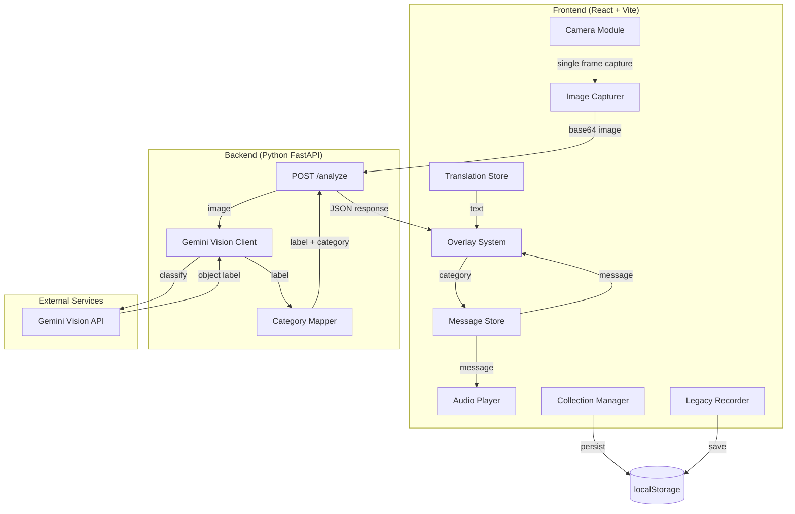
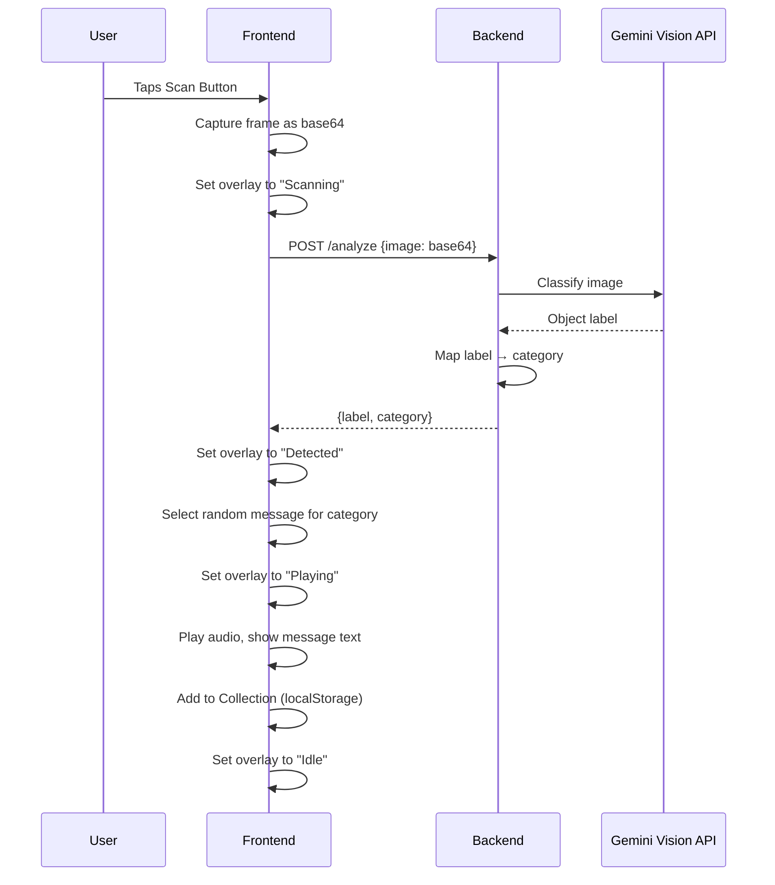

# Design Document: Last Message - Echoes from the Future

## Overview

"Last Message: Echoes from the Future" is an immersive web application where users scan real-world objects through their device camera and receive emotional voice messages from a climate-affected future. The system consists of a React + Vite frontend and a Python FastAPI backend. Object recognition is powered by the Gemini Vision API, objects are mapped to environmental categories, and pre-generated ElevenLabs audio delivers the narrative experience.

The architecture follows a simple client-server model: the frontend handles camera access, UI state management, audio playback, and local persistence, while the backend handles image classification and category mapping. The frontend is the primary orchestrator of user experience, managing overlay states, visual effects, and the collection system entirely client-side.

### Key Design Decisions

1. **Pre-generated audio over real-time TTS**: Audio files are pre-generated with ElevenLabs and bundled as static assets. This eliminates runtime latency and API costs for voice synthesis, keeping the experience fast and predictable.
2. **Client-side state management**: Overlay states, collection tracking, and legacy recordings are managed entirely in the browser using React state and localStorage. No user accounts or server-side sessions are needed.
3. **Simple category mapping**: A static lookup table maps object labels to five categories. Unknown objects default to "consumption" rather than failing, keeping the experience unbroken.
4. **Single-endpoint backend**: The backend exposes one POST /analyze endpoint. This keeps the API surface minimal and the deployment simple.

## Architecture



### Request Flow



## Components and Interfaces

### Frontend Components

#### 1. Camera Module (`components/Camera.tsx`)
- Requests camera permission via `navigator.mediaDevices.getUserMedia`
- Renders a `<video>` element as fullscreen background
- Exposes a ref for frame capture
- Handles permission denied and no-camera-available error states

#### 2. Image Capturer (`hooks/useImageCapture.ts`)
- Custom hook that takes a video element ref
- Draws current video frame to an offscreen `<canvas>`
- Returns base64-encoded JPEG string via `canvas.toDataURL('image/jpeg')`
- Exposes `captureFrame(): string` function

#### 3. Overlay System (`components/Overlay.tsx`)
- Manages four states: `Idle`, `Scanning`, `Detected`, `Playing`
- Renders state-dependent text and animations
- Uses CSS transitions for fade-in effects between states
- Accepts current state, object label, and message text as props

```typescript
type OverlayState = 'idle' | 'scanning' | 'detected' | 'playing';

interface OverlayProps {
  state: OverlayState;
  objectLabel?: string;
  messageText?: string;
}
```

#### 4. Audio Player (`hooks/useAudioPlayer.ts`)
- Custom hook wrapping the HTML5 `Audio` API
- Exposes `play(src: string): Promise<void>`, `stop(): void`, `isPlaying: boolean`
- Fires `onEnd` callback when playback completes
- Handles load/play errors by returning error state

```typescript
interface UseAudioPlayerReturn {
  play: (src: string) => Promise<void>;
  stop: () => void;
  isPlaying: boolean;
  error: string | null;
}
```

#### 5. Message Store (`data/messages.ts`)
- Static TypeScript module exporting messages organized by category
- Each message: `{ id: string, text: string, audioPath: string }`
- Provides `getRandomMessage(category: Category): Message` function
- Contains 3-5 messages per category

#### 6. Collection Manager (`hooks/useCollection.ts`)
- Custom hook managing discovered messages in localStorage
- Stores records: `{ messageId: string, category: Category, discoveredAt: string }`
- Prevents duplicate entries by checking messageId
- Exposes `addToCollection(record)`, `getCollection()`, `isDiscovered(messageId): boolean`

#### 7. Legacy Recorder (`components/LegacyRecorder.tsx`)
- Requests microphone permission via `navigator.mediaDevices.getUserMedia`
- Uses `MediaRecorder` API to capture audio
- Saves recordings as blobs in localStorage with "Human Legacy Message" tag
- Exposes start/stop recording controls

#### 8. Translation Store (`i18n/translations.ts`)
- Static module exporting `Record<string, Record<string, string>>`
- Default locale: `"en"`
- Provides `t(key: string, locale?: string): string` helper function

#### 9. Scan Orchestrator (`components/ScanOrchestrator.tsx`)
- Top-level component coordinating the scan flow
- Manages overlay state transitions
- Calls image capture → API → message selection → audio playback
- Handles timeout (5s) and error states
- Disables scan button during processing

### Backend Components

#### 1. Analyze Endpoint (`api/routes.py`)

```python
@app.post("/analyze")
async def analyze(request: AnalyzeRequest) -> AnalyzeResponse:
    """Accept base64 image, return object label and category."""
```

**Request:**
```json
{
  "image": "<base64-encoded-image-string>"
}
```

**Response (success):**
```json
{
  "label": "bottle",
  "category": "consumption"
}
```

**Response (error):**
```json
{
  "error": "Failed to classify image",
  "detail": "Gemini API returned an unexpected response"
}
```

#### 2. Gemini Vision Client (`services/gemini_client.py`)
- Wraps the Google Gemini Vision API
- Sends base64 image with a prompt asking for single-object identification
- Extracts and returns the object label string
- Raises typed exceptions on API errors

#### 3. Category Mapper (`services/category_mapper.py`)
- Pure function: `map_to_category(label: str) -> str`
- Static dictionary mapping known object labels to categories
- Returns `"consumption"` for unknown labels
- Five categories: `water`, `air`, `fauna`, `consumption`, `energy`

```python
CATEGORY_MAP: dict[str, str] = {
    "bottle": "consumption",
    "tree": "fauna",
    "car": "energy",
    "sky": "air",
    "river": "water",
    # ... additional mappings
}

VALID_CATEGORIES = {"water", "air", "fauna", "consumption", "energy"}

def map_to_category(label: str) -> str:
    return CATEGORY_MAP.get(label.lower().strip(), "consumption")
```

### API Interface

| Method | Path | Request Body | Response | Status Codes |
|--------|------|-------------|----------|-------------|
| POST | /analyze | `{ image: string }` | `{ label: string, category: string }` | 200, 400, 500 |

## Data Models

### Frontend Models

```typescript
// Categories
type Category = 'water' | 'air' | 'fauna' | 'consumption' | 'energy';

// Message from the future
interface Message {
  id: string;
  text: string;
  audioPath: string;
}

// Messages organized by category
type MessageStore = Record<Category, Message[]>;

// Collection record for a discovered message
interface CollectionRecord {
  messageId: string;
  category: Category;
  discoveredAt: string; // ISO 8601 timestamp
}

// Legacy recording
interface LegacyMessage {
  id: string;
  audioBlob: Blob;
  createdAt: string; // ISO 8601 timestamp
  tag: 'Human Legacy Message';
}

// Translation store structure
type TranslationStore = Record<string, Record<string, string>>;
// e.g., { "en": { "scan": "Scan", "analyzing": "Analyzing environment..." } }

// Overlay states
type OverlayState = 'idle' | 'scanning' | 'detected' | 'playing';

// API response from /analyze
interface AnalyzeResponse {
  label: string;
  category: Category;
}

interface AnalyzeError {
  error: string;
  detail: string;
}
```

### Backend Models

```python
from pydantic import BaseModel

class AnalyzeRequest(BaseModel):
    image: str  # base64-encoded image

class AnalyzeResponse(BaseModel):
    label: str
    category: str  # one of: water, air, fauna, consumption, energy

class AnalyzeErrorResponse(BaseModel):
    error: str
    detail: str
```

### Local Storage Schema

**Collection** (`localStorage key: "echoes-collection"`):
```json
[
  {
    "messageId": "water-001",
    "category": "water",
    "discoveredAt": "2025-01-15T10:30:00.000Z"
  }
]
```

**Legacy Messages** (`localStorage key: "echoes-legacy-messages"`):
```json
[
  {
    "id": "legacy-001",
    "createdAt": "2025-01-15T11:00:00.000Z",
    "tag": "Human Legacy Message"
  }
]
```
(Audio blobs stored separately via IndexedDB or as base64 in localStorage)

## Correctness Properties

*A property is a characteristic or behavior that should hold true across all valid executions of a system — essentially, a formal statement about what the system should do. Properties serve as the bridge between human-readable specifications and machine-verifiable correctness guarantees.*

### Property 1: Category mapping correctness

*For any* known object label in the predefined mapping table, `map_to_category` SHALL return the correct category for that label, and *for any* string not present in the mapping table, `map_to_category` SHALL return `"consumption"`. Additionally, calling `map_to_category` multiple times with the same label SHALL always produce the same result.

**Validates: Requirements 3.3, 3.4, 4.2, 4.3, 4.4**

### Property 2: Message selection returns correct category

*For any* valid category, calling `getRandomMessage(category)` SHALL return a Message object that belongs to that category's message list in the Message_Store.

**Validates: Requirements 5.3**

### Property 3: Message serialization round-trip

*For any* valid Message object, serializing it to JSON and then deserializing the JSON string SHALL produce an object equivalent to the original Message (with matching `id`, `text`, and `audioPath` fields).

**Validates: Requirements 5.5**

### Property 4: Collection no-duplicate invariant

*For any* message ID and any number of `addToCollection` calls with that same message ID, the Collection SHALL contain exactly one entry for that message ID.

**Validates: Requirements 9.5**

### Property 5: Collection record round-trip

*For any* valid CollectionRecord (containing `messageId`, `category`, and `discoveredAt`), storing it to localStorage and then retrieving it SHALL produce a record equivalent to the original.

**Validates: Requirements 9.6**

### Property 6: Translation lookup correctness

*For any* valid string key present in the Translation_Store for the current locale, calling `t(key)` SHALL return the exact string value stored in the Translation_Store for that key and locale.

**Validates: Requirements 11.4**

### Property 7: Translation store serialization round-trip

*For any* valid Translation_Store object, serializing it to JSON and then deserializing the JSON string SHALL produce an object deeply equal to the original Translation_Store.

**Validates: Requirements 11.5**

## Error Handling

### Frontend Error Handling

| Error Condition | Handling Strategy | User Feedback |
|----------------|-------------------|---------------|
| Camera permission denied | Catch `NotAllowedError` from `getUserMedia` | Display message: "Camera access is required to scan objects" |
| No camera available | Catch `NotFoundError` from `getUserMedia` | Display message: "A camera-equipped device is required" |
| API timeout (>5s) | `AbortController` with 5s timeout on fetch | Display timeout message, return overlay to Idle |
| API error response | Check response status, parse error body | Display generic error message, return overlay to Idle |
| Audio playback failure | Catch `error` event on `Audio` element | Display message text as fallback, return overlay to Idle |
| Microphone permission denied | Catch `NotAllowedError` from `getUserMedia` | Display message: "Microphone access is required for recording" |
| localStorage full | Catch `QuotaExceededError` on `setItem` | Silently fail for collection; warn user for legacy recordings |
| Invalid API response shape | Validate response against expected schema | Display generic error, return overlay to Idle |

### Backend Error Handling

| Error Condition | Handling Strategy | HTTP Response |
|----------------|-------------------|---------------|
| Missing or empty `image` field | Pydantic validation | 400 with `{ "error": "Invalid request", "detail": "image field is required" }` |
| Invalid base64 encoding | Try/catch on decode | 400 with `{ "error": "Invalid image", "detail": "Image is not valid base64" }` |
| Gemini API error | Catch API exceptions | 500 with `{ "error": "Classification failed", "detail": "<error message>" }` |
| Gemini API timeout | httpx timeout config | 500 with `{ "error": "Classification timeout", "detail": "Gemini API did not respond in time" }` |
| Gemini returns no label | Check for empty/null result | 500 with `{ "error": "Classification failed", "detail": "Could not identify object in image" }` |

### Error Recovery Strategy

- **Overlay always returns to Idle**: Any error during the scan flow resets the overlay to the Idle state, allowing the user to try again.
- **Scan button re-enabled on error**: The scan button is re-enabled whenever an error occurs or the flow completes.
- **Graceful degradation for audio**: If audio fails, the message text is shown visually as a fallback.
- **No data loss on storage errors**: Collection and legacy message operations catch storage errors and degrade gracefully without crashing the app.

## Testing Strategy

### Unit Tests (Example-Based)

Unit tests cover specific behaviors, UI states, error conditions, and integration points.

**Frontend unit tests** (Vitest + React Testing Library):
- Camera module: permission granted, denied, no camera scenarios
- Overlay system: correct text and CSS classes for each of the four states
- Overlay transitions: fade-in class applied on state change
- Audio player: play, stop, error handling, onEnd callback
- Scan orchestrator: full scan flow with mocked API, timeout handling, button disable/enable
- Collection view: grid rendering, locked items for undiscovered messages
- Legacy recorder: start/stop recording, save with correct tag
- Navigation: three buttons render, collection and legacy overlays toggle
- Visual effects: glitch, blur, and gradient classes applied in correct states

**Backend unit tests** (pytest):
- Analyze endpoint: valid request returns label + category, invalid request returns 400
- Gemini client: mock API responses, error handling
- Category mapper: specific known mappings, case insensitivity, whitespace trimming

### Property-Based Tests

Property-based tests verify universal correctness properties across many generated inputs. Each test runs a minimum of 100 iterations.

**Library**: `fast-check` (frontend, TypeScript), `hypothesis` (backend, Python)

| Property | Test Description | Library | Min Iterations |
|----------|-----------------|---------|---------------|
| Property 1: Category mapping correctness | Generate random known labels → verify correct category; generate random unknown strings → verify "consumption" default; verify idempotence | hypothesis | 100 |
| Property 2: Message selection returns correct category | Generate random valid categories → call getRandomMessage → verify returned message is in that category's list | fast-check | 100 |
| Property 3: Message serialization round-trip | Generate random Message objects → JSON.stringify → JSON.parse → verify deep equality | fast-check | 100 |
| Property 4: Collection no-duplicate invariant | Generate random message IDs and random repeat counts → add same ID multiple times → verify exactly one entry | fast-check | 100 |
| Property 5: Collection record round-trip | Generate random CollectionRecord objects → store to mock localStorage → retrieve → verify deep equality | fast-check | 100 |
| Property 6: Translation lookup correctness | Generate random valid keys from the store → call t(key) → verify matches stored value | fast-check | 100 |
| Property 7: Translation store serialization round-trip | Generate random TranslationStore objects → JSON.stringify → JSON.parse → verify deep equality | fast-check | 100 |

**Tagging format**: Each property test includes a comment:
```
// Feature: last-message-echoes, Property {N}: {property title}
```

### Integration Tests

- **POST /analyze end-to-end**: Send a real base64 image to the endpoint with a mocked Gemini client, verify full response flow
- **Scan flow integration**: Simulate button tap → capture → API call → message selection → audio playback with mocked backend
- **localStorage persistence**: Store collection records, simulate page refresh (re-mount), verify data survives

### Smoke Tests

- Message_Store contains 3-5 messages per category, each with id, text, and audioPath
- Translation_Store has "en" locale with all required keys
- Backend starts and /analyze endpoint is reachable

