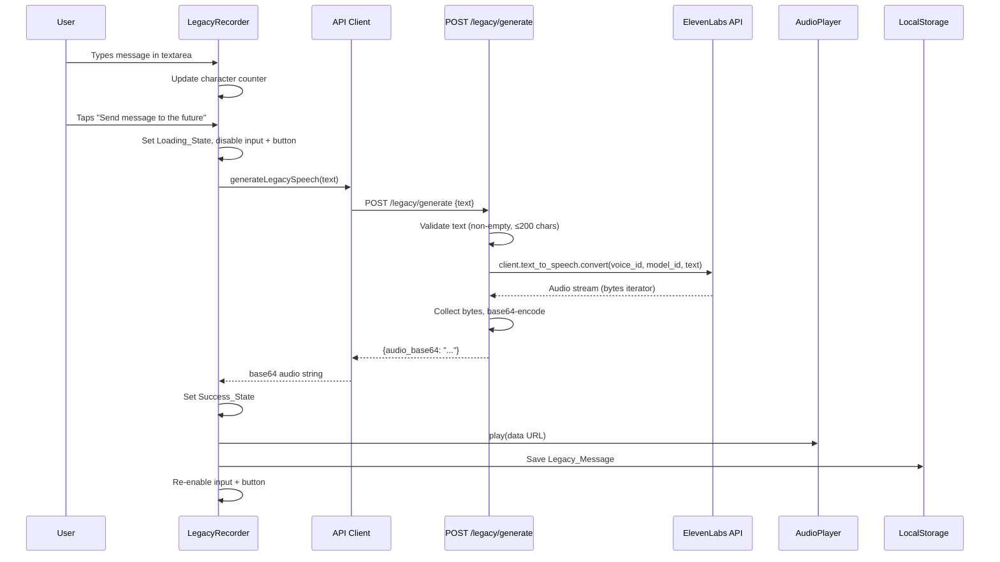
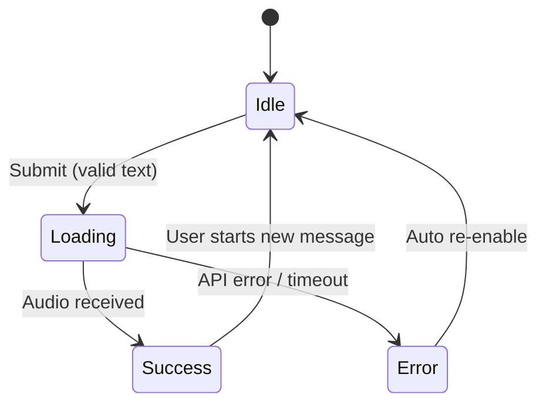

# Design Document: Legacy ElevenLabs Text-to-Speech

## Overview

This feature replaces the microphone-based recording flow in Legacy Mode with a text-to-speech flow powered by the ElevenLabs API. Users type a short message (up to 200 characters) in a textarea, submit it, and the backend generates realistic AI speech via the ElevenLabs `text_to_speech.convert()` SDK method. The generated audio is returned as base64-encoded data, played back immediately in the browser, and saved locally as a Legacy Message.

The integration is scoped exclusively to Legacy Mode. The main scanning experience continues to use pre-generated audio files. The backend exposes a new `POST /legacy/generate` endpoint in a separate route group, and the frontend's `LegacyRecorder` component is refactored from microphone recording to text input + TTS generation.

### Key Design Decisions

1. **Backend-mediated TTS**: The ElevenLabs API key stays on the server. The frontend sends plain text; the backend calls ElevenLabs and returns base64 audio. This avoids exposing API credentials in the browser.
2. **Base64 audio transport**: Audio is returned as a base64 string in JSON rather than as a binary stream. This keeps the API interface simple and consistent with the existing `analyzeImage` pattern, and the audio clips are small (a few seconds of speech for ≤200 characters).
3. **Reuse existing hooks**: The `useAudioPlayer` hook handles playback. The localStorage persistence pattern from `useCollection` is reused for legacy message storage.
4. **Separate route group**: The legacy endpoint is registered on a separate `APIRouter` to keep it isolated from the `/analyze` endpoint, matching the scope isolation requirement.
5. **ElevenLabs Python SDK**: Uses the official `elevenlabs` package with `client.text_to_speech.convert()` rather than raw HTTP calls. The SDK handles auth, streaming, and error mapping.

## Architecture

```mermaid
graph TB
    subgraph Frontend ["Frontend (React + Vite)"]
        LegacyRecorder["LegacyRecorder Component"]
        TextInput["Legacy_Input (textarea)"]
        CharCounter["Character_Counter"]
        SubmitBtn["Submit_Button"]
        AudioPlayer["useAudioPlayer Hook"]
        APIClient["API Client (generateLegacySpeech)"]
        LocalStorage[(localStorage)]
    end

    subgraph Backend ["Backend (Python FastAPI)"]
        LegacyRouter["POST /legacy/generate"]
        ElevenLabsClient["ElevenLabs_Client Service"]
    end

    subgraph External ["External Services"]
        ElevenLabsAPI["ElevenLabs TTS API"]
    end

    TextInput -->|text| SubmitBtn
    CharCounter -.->|count display| TextInput
    SubmitBtn -->|submit| APIClient
    APIClient -->|POST /legacy/generate| LegacyRouter
    LegacyRouter -->|text| ElevenLabsClient
    ElevenLabsClient -->|convert()| ElevenLabsAPI
    ElevenLabsAPI -->|audio stream| ElevenLabsClient
    ElevenLabsClient -->|base64 audio| LegacyRouter
    LegacyRouter -->|JSON {audio_base64}| APIClient
    APIClient -->|base64 audio| LegacyRecorder
    LegacyRecorder -->|play| AudioPlayer
    LegacyRecorder -->|save Legacy_Message| LocalStorage
```

### Request Flow



## Components and Interfaces

### Backend Components

#### 1. ElevenLabs Client Service (`services/elevenlabs_client.py`)

New module wrapping the ElevenLabs Python SDK.

```python
"""ElevenLabs TTS client module."""
import os
import base64
from elevenlabs.client import ElevenLabs

VOICE_ID = "JBFqnCBsd6RMkjVDRZzb"  # George voice
MODEL_ID = "eleven_flash_v2_5"

class ElevenLabsConfigError(Exception):
    """Raised when the API key is not configured."""

class ElevenLabsTTSError(Exception):
    """Raised when the TTS API call fails."""

def generate_speech(text: str) -> str:
    """Convert text to speech and return base64-encoded audio.

    Args:
        text: The text to convert (1-200 characters).

    Returns:
        Base64-encoded audio string.

    Raises:
        ElevenLabsConfigError: If ELEVENLABS_API_KEY is not set.
        ElevenLabsTTSError: If the API call fails.
    """
    api_key = os.environ.get("ELEVENLABS_API_KEY", "")
    if not api_key:
        raise ElevenLabsConfigError("ElevenLabs API key not configured")

    client = ElevenLabs(api_key=api_key)
    audio_iterator = client.text_to_speech.convert(
        voice_id=VOICE_ID,
        model_id=MODEL_ID,
        text=text,
    )
    audio_bytes = b"".join(audio_iterator)
    return base64.b64encode(audio_bytes).decode("utf-8")
```

**Key points:**
- Synchronous function — the ElevenLabs SDK is synchronous, so the route handler will call it in a thread via FastAPI's default threadpool executor for `def` endpoints (or explicitly with `run_in_executor` if the route is `async`).
- Constants `VOICE_ID` and `MODEL_ID` are module-level for easy configuration.
- Returns raw base64 (no `data:` prefix). The frontend adds the data URL prefix.

#### 2. Legacy Route (`api/legacy_routes.py`)

New route module with a separate `APIRouter`.

```python
"""Legacy mode routes for text-to-speech generation."""
from fastapi import APIRouter
from api.models import LegacyGenerateRequest, LegacyGenerateResponse, LegacyErrorResponse

legacy_router = APIRouter(prefix="/legacy", tags=["legacy"])

@legacy_router.post(
    "/generate",
    response_model=LegacyGenerateResponse,
    responses={400: {"model": LegacyErrorResponse}, 500: {"model": LegacyErrorResponse}},
)
async def generate_legacy_speech(request: LegacyGenerateRequest):
    """Accept text and return base64-encoded TTS audio."""
```

**Validation logic:**
- If `text` is missing/empty → 400 "Text field is required"
- If `text` exceeds 200 characters → 400 "Text exceeds 200 character limit"
- If `ELEVENLABS_API_KEY` not set → 500 "ElevenLabs API key not configured"
- If ElevenLabs API fails → 500 "Voice generation failed"

**Registration in `main.py`:**
```python
from api.legacy_routes import legacy_router
app.include_router(legacy_router)
```

#### 3. Backend Models (additions to `api/models.py`)

```python
class LegacyGenerateRequest(BaseModel):
    text: str

class LegacyGenerateResponse(BaseModel):
    audio_base64: str

class LegacyErrorResponse(BaseModel):
    error: str
```

### Frontend Components

#### 1. API Client Addition (`api/client.ts`)

New function alongside the existing `analyzeImage`:

```typescript
export interface LegacyGenerateResponse {
  audio_base64: string;
}

export async function generateLegacySpeech(
  text: string,
  signal?: AbortSignal,
): Promise<LegacyGenerateResponse> {
  const response = await fetch(`${API_URL}/legacy/generate`, {
    method: 'POST',
    headers: { 'Content-Type': 'application/json' },
    body: JSON.stringify({ text }),
    signal,
  });

  if (!response.ok) {
    const body = await response.json().catch(() => null);
    const detail = body?.error ?? 'Unknown error';
    throw new Error(detail);
  }

  return (await response.json()) as LegacyGenerateResponse;
}
```

Uses the same `API_URL` and `AbortSignal` pattern as `analyzeImage`. The 10-second timeout is managed by the component via `AbortController`.

#### 2. Refactored LegacyRecorder Component (`components/LegacyRecorder.tsx`)

The component is refactored from microphone recording to text-to-speech. The core changes:

**Removed:**
- `MediaRecorder` / `getUserMedia({ audio: true })` logic
- Record/Stop button pair
- `blobToBase64` helper

**Added:**
- `<textarea>` with 200-character `maxLength`
- Character counter display (`{count} / 200`)
- Submit button ("Send message to the future") with disabled state
- Loading state ("📡 Transmitting to the future…")
- Success state ("Message received by the future") with audio playback control
- Error state ("Transmission failed… try again")
- 10-second request timeout via `AbortController`

**State machine:**



**Component states:**
- `idle` — textarea editable, submit enabled (if text present), saved messages visible
- `loading` — textarea read-only, submit disabled, "📡 Transmitting to the future…" shown
- `success` — "Message received by the future" shown, audio playback control visible, textarea re-enabled
- `error` — "Transmission failed… try again" shown, textarea and submit re-enabled

**Updated `StoredLegacyMessage` interface:**

```typescript
export interface StoredLegacyMessage {
  id: string;
  text: string;           // original message text (new field)
  audioData: string;      // base64 audio (kept from existing)
  createdAt: string;      // ISO 8601 timestamp
  type: 'legacy';         // changed from tag: 'Human Legacy Message'
}
```

The `tag` field is replaced with `type: 'legacy'` per the requirements. The `text` field stores the original message for display and fallback.

#### 3. Translation Store Additions (`i18n/translations.ts`)

New keys added to the `en` locale:

```typescript
// Legacy TTS mode
legacy_tts_title: 'Leave a message for the future',
legacy_tts_placeholder: 'Type your message...',
legacy_tts_submit: 'Send message to the future',
legacy_tts_loading: '📡 Transmitting to the future…',
legacy_tts_success: 'Message received by the future',
legacy_tts_error: 'Transmission failed… try again',
legacy_tts_empty: 'Write your first message to leave your mark on the future.',
```

#### 4. Type Additions (`types/index.ts`)

```typescript
// Legacy TTS message (replaces LegacyMessage)
export interface LegacyTTSMessage {
  id: string;
  text: string;
  audioData: string;      // base64-encoded audio
  createdAt: string;      // ISO 8601 timestamp
  type: 'legacy';
}

// Legacy generate API response
export interface LegacyGenerateResponse {
  audio_base64: string;
}
```

### API Interface

| Method | Path | Request Body | Response (200) | Error Responses |
|--------|------|-------------|----------------|-----------------|
| POST | /legacy/generate | `{ text: string }` | `{ audio_base64: string }` | 400: `{ error: string }`, 500: `{ error: string }` |

## Data Models

### Backend Models

```python
# New models in api/models.py

class LegacyGenerateRequest(BaseModel):
    text: str  # 1-200 characters

class LegacyGenerateResponse(BaseModel):
    audio_base64: str  # base64-encoded audio bytes

class LegacyErrorResponse(BaseModel):
    error: str  # human-readable error message
```

### Frontend Models

```typescript
// Updated Legacy message type
interface LegacyTTSMessage {
  id: string;           // crypto.randomUUID()
  text: string;         // original message text, 1-200 chars
  audioData: string;    // base64-encoded audio (with data: prefix for playback)
  createdAt: string;    // ISO 8601 timestamp
  type: 'legacy';       // discriminator field
}

// API response from /legacy/generate
interface LegacyGenerateResponse {
  audio_base64: string; // raw base64 (no data: prefix)
}
```

### localStorage Schema

**Legacy Messages** (`key: "echoes-legacy-messages"`):
```json
[
  {
    "id": "a1b2c3d4-...",
    "text": "Remember the sound of rain",
    "audioData": "data:audio/mpeg;base64,//uQx...",
    "createdAt": "2025-07-15T10:30:00.000Z",
    "type": "legacy"
  }
]
```

## Correctness Properties

*A property is a characteristic or behavior that should hold true across all valid executions of a system — essentially, a formal statement about what the system should do. Properties serve as the bridge between human-readable specifications and machine-verifiable correctness guarantees.*

### Property 1: Character counter accuracy

*For any* string of length 0 to 200, typing that string into the Legacy_Input SHALL result in the Character_Counter displaying exactly `"{length} / 200"` where `{length}` equals the string's character count, and the textarea SHALL contain the full input string.

**Validates: Requirements 1.2, 1.3**

### Property 2: Submit button enabled state

*For any* string, the Submit_Button SHALL be enabled if and only if the string's length is between 1 and 200 inclusive. For the empty string (length 0), the Submit_Button SHALL be disabled.

**Validates: Requirements 1.4, 1.6**

### Property 3: Backend text validation rejects invalid input

*For any* text string that is empty or exceeds 200 characters, the Legacy_Endpoint SHALL return an HTTP 400 response. Empty or whitespace-only text returns "Text field is required"; text longer than 200 characters returns "Text exceeds 200 character limit".

**Validates: Requirements 3.5, 3.6**

### Property 4: Audio base64 encoding round-trip

*For any* sequence of bytes produced by the ElevenLabs audio stream, encoding those bytes to base64 and then decoding the base64 string SHALL produce a byte sequence identical to the original.

**Validates: Requirements 3.3**

### Property 5: Legacy message localStorage round-trip

*For any* valid LegacyTTSMessage (containing a non-empty id, text of 1-200 characters, non-empty audioData string, a valid ISO 8601 createdAt timestamp, and type "legacy"), serializing the message to JSON, storing it in localStorage, retrieving it, and deserializing SHALL produce a record deeply equal to the original message.

**Validates: Requirements 5.1, 5.2, 5.5**

## Error Handling

### Frontend Error Handling

| Error Condition | Handling Strategy | User Feedback |
|----------------|-------------------|---------------|
| Empty textarea on submit | Disable Submit_Button when text length is 0 | Button visually disabled, no action |
| API returns error (4xx/5xx) | Catch non-ok response, parse error body | Display "Transmission failed… try again", re-enable textarea and button |
| API timeout (>10s) | `AbortController` with 10s timeout on fetch | Display "Transmission failed… try again", re-enable textarea and button |
| Network failure | Catch fetch TypeError | Display "Transmission failed… try again", re-enable textarea and button |
| Audio playback failure | Catch error event on Audio element | Display original message text as fallback |
| localStorage full | Catch `QuotaExceededError` on `setItem` | Silently degrade — message plays but is not saved |
| Invalid stored data on load | Catch JSON.parse errors, validate array shape | Return empty array, no crash |

### Backend Error Handling

| Error Condition | Handling Strategy | HTTP Response |
|----------------|-------------------|---------------|
| Missing or empty `text` field | Check before calling ElevenLabs | 400 `{ "error": "Text field is required" }` |
| `text` exceeds 200 characters | Length check before calling ElevenLabs | 400 `{ "error": "Text exceeds 200 character limit" }` |
| `ELEVENLABS_API_KEY` not set | `ElevenLabsConfigError` raised by client | 500 `{ "error": "ElevenLabs API key not configured" }` |
| ElevenLabs API error/unreachable | Catch SDK exceptions, wrap as `ElevenLabsTTSError` | 500 `{ "error": "Voice generation failed" }` |
| ElevenLabs API timeout | SDK timeout or httpx timeout | 500 `{ "error": "Voice generation failed" }` |

### Error Recovery Strategy

- **Controls always re-enable on error**: Any error during the TTS flow re-enables the textarea and submit button, allowing the user to try again immediately.
- **Loading state clears on error**: The loading indicator is replaced with the error message.
- **Audio fallback**: If audio playback fails after successful generation, the original message text is displayed as a visual fallback.
- **No data loss on storage errors**: If localStorage is full, the audio still plays — only persistence fails, and it fails silently.
- **Timeout prevents hanging**: The 10-second `AbortController` timeout ensures the UI never gets stuck in a loading state.

## Testing Strategy

### Unit Tests (Example-Based)

Unit tests cover specific behaviors, UI states, error conditions, and integration points.

**Frontend unit tests** (Vitest + React Testing Library):
- LegacyRecorder renders title, textarea, counter, and submit button on mount (Req 1.1)
- Submit button disabled when textarea is empty (Req 1.4)
- Submitting valid text calls `generateLegacySpeech` with correct payload (Req 2.1)
- Loading state shows "📡 Transmitting to the future…" during API call (Req 2.2)
- Submit button disabled and textarea read-only during loading (Req 2.3, 2.4)
- Success state shows "Message received by the future" and audio control (Req 2.5)
- Audio auto-plays on successful generation (Req 4.1)
- Audio control remains visible after playback ends (Req 4.3)
- Replay button triggers playback again (Req 4.4)
- Saved messages loaded from localStorage on mount (Req 5.3)
- Clicking a saved message plays its audio (Req 5.4)
- API error displays "Transmission failed… try again" and re-enables controls (Req 6.2)
- 10-second timeout aborts request and shows error (Req 6.3)
- Audio playback error shows original text as fallback (Req 6.4)
- localStorage full error does not crash UI (Req 6.5)

**Backend unit tests** (pytest):
- `POST /legacy/generate` with valid text returns 200 with `audio_base64` (Req 3.1, mocked SDK)
- `generate_speech` calls SDK with correct `voice_id` and `model_id` (Req 3.2)
- Empty text returns 400 "Text field is required" (Req 3.5)
- Text >200 chars returns 400 "Text exceeds 200 character limit" (Req 3.6)
- Missing `ELEVENLABS_API_KEY` returns 500 "ElevenLabs API key not configured" (Req 8.3)
- ElevenLabs SDK exception returns 500 "Voice generation failed" (Req 6.1)
- `VOICE_ID` constant matches expected value (Req 8.4)
- `MODEL_ID` constant equals "eleven_flash_v2_5" (Req 8.5)

### Property-Based Tests

Property-based tests verify universal correctness properties across many generated inputs. Each test runs a minimum of 100 iterations.

**Libraries**: `fast-check` (frontend, TypeScript), `hypothesis` (backend, Python)

| Property | Test Description | Library | Min Iterations |
|----------|-----------------|---------|---------------|
| Property 1: Character counter accuracy | Generate random strings (0-200 chars), render component, verify counter text matches `"{len} / 200"` and textarea contains full string | fast-check | 100 |
| Property 2: Submit button enabled state | Generate random strings (0-300 chars), render component, verify button disabled iff length is 0 or >200 | fast-check | 100 |
| Property 3: Backend text validation rejects invalid input | Generate random empty strings and strings of length 201-1000, POST to endpoint, verify 400 response with correct error message | hypothesis | 100 |
| Property 4: Audio base64 encoding round-trip | Generate random byte sequences (0-10KB), encode to base64, decode back, verify identical bytes | hypothesis | 100 |
| Property 5: Legacy message localStorage round-trip | Generate random LegacyTTSMessage objects (random id, text 1-200 chars, random audioData, random ISO timestamp, type "legacy"), JSON.stringify → localStorage.setItem → localStorage.getItem → JSON.parse, verify deep equality | fast-check | 100 |

**Tagging format**: Each property test includes a comment referencing the design property:
```
// Feature: legacy-elevenlabs-tts, Property {N}: {property title}
```
(Python equivalent: `# Feature: legacy-elevenlabs-tts, Property {N}: {property title}`)

### Integration Tests

- **POST /legacy/generate end-to-end**: Send valid text to the endpoint with a mocked ElevenLabs SDK, verify full response flow including base64 encoding
- **Full TTS flow**: Simulate typing text → clicking submit → receiving audio → playback → localStorage save, with mocked backend
- **localStorage persistence**: Store legacy messages, simulate component re-mount, verify messages survive and display correctly

### Smoke Tests

- `elevenlabs` package is listed in `requirements.txt`
- `VOICE_ID` and `MODEL_ID` constants are defined in `elevenlabs_client.py`
- Legacy router is registered as a separate `APIRouter` from the analyze router
- LegacyRecorder component does not import from scanning or environmental message modules

