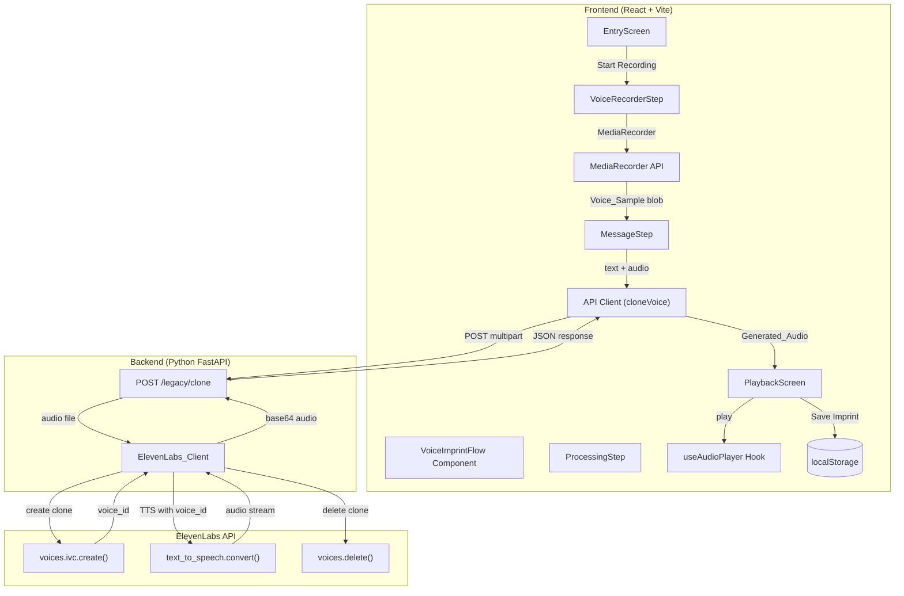

# Design Document: Legacy Voice Imprint

## Overview

This feature adds a "Voice Imprint" flow to Legacy Mode, allowing users to record a short voice sample (5–10 seconds), clone their voice via the ElevenLabs API, generate a spoken message using the cloned voice, and play it back with a cinematic narrative experience. The cloned voice is ephemeral — created, used, and deleted within a single backend request. The resulting audio is saved locally as a "Legacy Voice Imprint" record.

The flow is a multi-step experience within the existing Legacy Mode overlay: Entry Screen → Voice Recording → Message Input → Processing → Narrative Playback → Save. Each step transitions with smooth fade animations and uses the app's existing dark/glow aesthetic.

### Key Design Decisions

1. **Single-request clone lifecycle**: The backend creates a temporary voice clone, generates TTS audio with it, and deletes the clone — all within one POST request. This avoids persisting voice data and simplifies cleanup. A `try/finally` block ensures the clone is always deleted, even on TTS failure.
2. **Multipart form upload**: The `/legacy/clone` endpoint accepts `multipart/form-data` with an audio file and optional text field. This is the natural format for file uploads and aligns with how the ElevenLabs SDK expects voice files.
3. **ElevenLabs IVC (Instant Voice Clone) API**: Uses `client.voices.ivc.create()` for cloning and `client.text_to_speech.convert()` for generation, then `client.voices.delete()` for cleanup. All via the official Python SDK already in `requirements.txt`.
4. **MediaRecorder API for capture**: The browser's MediaRecorder API captures audio in WebM (Opus) format, which is widely supported and produces small files suitable for upload. WAV fallback is provided for browsers that don't support WebM.
5. **Fallback to default voice**: If voice cloning fails on retry, the system falls back to the existing default ElevenLabs voice (George, `JBFqnCBsd6RMkjVDRZzb`) for TTS generation, ensuring the user still gets a result.
6. **Scope isolation**: The clone endpoint is added to the existing `legacy_router` as a separate route. Frontend components for the Voice Imprint flow are new files that don't import scanning or environmental message modules.
7. **Reuse existing infrastructure**: The `useAudioPlayer` hook handles all audio playback. The localStorage persistence pattern from `LegacyRecorder` is reused for voice imprint records. The `generateLegacySpeech` API client pattern is extended with a new `cloneVoice` function.

## Architecture



## Components and Interfaces

### Backend Components

#### ElevenLabs Client Extension (`backend/services/elevenlabs_client.py`)

New functions added to the existing module:

```python
class ElevenLabsVoiceCloneError(Exception):
    """Raised when voice cloning fails."""

def clone_voice_and_generate(audio_bytes: bytes, filename: str, text: str) -> str:
    """Clone a voice from audio, generate TTS, delete the clone, return base64 audio.
    
    Args:
        audio_bytes: Raw audio file bytes from the uploaded voice sample.
        filename: Original filename (used for MIME type detection).
        text: Message text to synthesize with the cloned voice.
    
    Returns:
        Base64-encoded audio string.
    
    Raises:
        ElevenLabsConfigError: If ELEVENLABS_API_KEY is not set.
        ElevenLabsVoiceCloneError: If voice cloning fails.
        ElevenLabsTTSError: If TTS generation fails after successful cloning.
    """
```

Internal flow:
1. Read `ELEVENLABS_API_KEY` from environment
2. Create `ElevenLabs` client
3. Call `client.voices.ivc.create(name="temp-voice-imprint", files=[audio_file])` → get `voice_id`
4. In a `try/finally` block:
   - Call `client.text_to_speech.convert(voice_id=voice_id, model_id=MODEL_ID, text=text)` → collect audio bytes
   - In `finally`: call `client.voices.delete(voice_id=voice_id)` to clean up
5. Return `base64.b64encode(audio_bytes).decode("utf-8")`

```python
def generate_speech_with_fallback(text: str) -> str:
    """Generate speech using the default voice (fallback path).
    
    Reuses the existing generate_speech() function.
    """
```

#### Clone Endpoint (`backend/api/legacy_routes.py`)

New route added to the existing `legacy_router`:

```python
@legacy_router.post("/clone")
async def clone_voice(audio: UploadFile = File(...), text: str = Form("")):
    """Accept voice sample + optional text, return base64 TTS audio from cloned voice.
    
    Request: multipart/form-data
        - audio: Audio file (WAV or WebM), required
        - text: Message text (optional, defaults to predefined message)
    
    Response: 200 OK
        { "audio_base64": "<base64-encoded audio>" }
    
    Errors:
        - 400: Audio file missing or empty
        - 500: API key not configured, cloning failed, or TTS failed
    """
```

#### Pydantic Models (`backend/api/models.py`)

```python
class LegacyCloneResponse(BaseModel):
    audio_base64: str

# LegacyErrorResponse already exists and is reused
```

### Frontend Components

#### VoiceImprintFlow (`frontend/src/components/VoiceImprintFlow.tsx`)

Top-level orchestrator component managing the multi-step flow:

```typescript
type FlowStep = 'entry' | 'recording' | 'message' | 'processing' | 'playback';

interface VoiceImprintFlowProps {
  // No props needed — self-contained flow
}

export function VoiceImprintFlow(): JSX.Element;
```

State machine:
- `entry` → user taps "Start Recording" → `recording`
- `recording` → recording completes → `message`
- `message` → user confirms text → `processing`
- `processing` → API returns audio → `playback`
- `processing` → API error → `recording` (retry) or `playback` (fallback)
- `playback` → user taps "Replay" → replays with narrative
- `playback` → user taps "Save Imprint" → saves to localStorage

#### EntryScreen (`frontend/src/components/voice-imprint/EntryScreen.tsx`)

```typescript
interface EntryScreenProps {
  onStart: () => void;
}
```

Displays title "Leave your voice in the future", subtitle "Your voice can outlive you", and a "Start Recording" button. Requests microphone permission on button tap.

#### VoiceRecorderStep (`frontend/src/components/voice-imprint/VoiceRecorderStep.tsx`)

```typescript
interface VoiceRecorderStepProps {
  onComplete: (audioBlob: Blob) => void;
}
```

Uses `MediaRecorder` API to capture audio. Displays:
- Waveform animation (driven by `AnalyserNode` from Web Audio API)
- Recording timer (elapsed seconds)
- Stop button (disabled until 5 seconds, auto-stops at 10 seconds)

Implementation details:
- Creates `AudioContext` + `AnalyserNode` for real-time frequency data
- `MediaRecorder` with `mimeType: 'audio/webm;codecs=opus'` (fallback to `'audio/webm'` then `'audio/wav'`)
- Timer via `setInterval` with 1-second ticks
- Cleanup: stops all tracks on `MediaStream` when unmounting

#### MessageStep (`frontend/src/components/voice-imprint/MessageStep.tsx`)

```typescript
interface MessageStepProps {
  onConfirm: (text: string) => void;
}
```

Textarea for custom message (max 200 chars) with character counter. Provides a default message from a predefined set if the user submits empty. Default messages:

```typescript
const DEFAULT_MESSAGES = [
  "I was here. Remember my voice.",
  "This is my echo, reaching across time.",
  "To whoever finds this — I existed.",
  "My voice carries forward what words alone cannot.",
  "Let this sound outlast the silence.",
];
```

#### PlaybackScreen (`frontend/src/components/voice-imprint/PlaybackScreen.tsx`)

```typescript
interface PlaybackScreenProps {
  audioData: string;       // base64 audio with data: prefix
  messageText: string;
  onReplay: () => void;
  onSave: () => void;
  onRetry: () => void;
  showSave: boolean;       // false after already saved
}
```

Handles the narrative overlay sequence, audio playback, and post-playback actions.

#### NarrativeOverlay (`frontend/src/components/voice-imprint/NarrativeOverlay.tsx`)

```typescript
interface NarrativeOverlayProps {
  onComplete: () => void;
  showIntro?: boolean;     // whether to show the optional narrative intro
}
```

Displays timed text sequence:
1. (Optional) "We recovered this voice… It belongs to someone from your time…" — typewriter animation over 3 seconds
2. "📡 Signal reconstructed…" — 2 seconds
3. "Voice imprint detected…" — 2 seconds  
4. "Playing message from the future…" — 1.5 seconds
5. Calls `onComplete` to trigger audio playback

#### WaveformVisualizer (`frontend/src/components/voice-imprint/WaveformVisualizer.tsx`)

```typescript
interface WaveformVisualizerProps {
  analyserNode: AnalyserNode | null;
  isActive: boolean;
}
```

Renders animated bars driven by frequency data from the `AnalyserNode`. Uses `requestAnimationFrame` for smooth 60fps updates. Bars use green/cyan glow colors consistent with the app theme.

#### useVoiceRecorder Hook (`frontend/src/hooks/useVoiceRecorder.ts`)

```typescript
interface UseVoiceRecorderReturn {
  startRecording: () => Promise<void>;
  stopRecording: () => void;
  isRecording: boolean;
  elapsedSeconds: number;
  analyserNode: AnalyserNode | null;
  error: string | null;
}

export function useVoiceRecorder(options: {
  maxDuration?: number;    // default 10
  minDuration?: number;    // default 5
  onComplete: (blob: Blob) => void;
}): UseVoiceRecorderReturn;
```

Encapsulates MediaRecorder + AudioContext + timer logic. Auto-stops at `maxDuration`. Produces a single Blob on stop.

#### API Client Extension (`frontend/src/api/client.ts`)

```typescript
export async function cloneVoice(
  audioBlob: Blob,
  text: string,
  signal?: AbortSignal,
): Promise<LegacyCloneResponse> {
  const formData = new FormData();
  formData.append('audio', audioBlob, 'voice-sample.webm');
  formData.append('text', text);

  const response = await fetch(`${API_URL}/legacy/clone`, {
    method: 'POST',
    body: formData,
    signal,
  });

  if (!response.ok) {
    const body = await response.json().catch(() => null);
    throw new Error(body?.error ?? 'Clone failed');
  }

  return (await response.json()) as LegacyCloneResponse;
}
```

### Integration with Existing App

The `VoiceImprintFlow` component is rendered inside the Legacy Mode overlay in `App.tsx`, alongside the existing `LegacyRecorder`. A tab or toggle within the Legacy overlay switches between "Text Message" (existing TTS) and "Voice Imprint" (new flow).

## Data Models

### Backend Models

```python
# backend/api/models.py — additions

class LegacyCloneResponse(BaseModel):
    audio_base64: str
```

The request uses FastAPI's `UploadFile` and `Form` parameters directly (no Pydantic model needed for multipart).

### Frontend Types

```typescript
// frontend/src/types/index.ts — additions

export interface VoiceImprintRecord {
  id: string;
  type: 'legacy_voice';
  text: string;
  audioData: string;       // base64-encoded audio with data: prefix
  createdAt: string;       // ISO 8601
}

export interface LegacyCloneResponse {
  audio_base64: string;
}
```

### localStorage Schema

Voice imprint records are stored under the key `echoes-voice-imprints`:

```json
[
  {
    "id": "uuid-v4",
    "type": "legacy_voice",
    "text": "I was here. Remember my voice.",
    "audioData": "data:audio/mpeg;base64,SGVsbG8...",
    "createdAt": "2025-01-15T10:30:00.000Z"
  }
]
```

Separate from the existing `echoes-legacy-messages` key used by the TTS flow.

### Predefined Message Texts

```typescript
const DEFAULT_MESSAGES: string[] = [
  "I was here. Remember my voice.",
  "This is my echo, reaching across time.",
  "To whoever finds this — I existed.",
  "My voice carries forward what words alone cannot.",
  "Let this sound outlast the silence.",
];
```

A random message is selected when the user does not provide custom text.


## Correctness Properties

*A property is a characteristic or behavior that should hold true across all valid executions of a system — essentially, a formal statement about what the system should do. Properties serve as the bridge between human-readable specifications and machine-verifiable correctness guarantees.*

### Property 1: Base64 audio encoding round-trip

*For any* sequence of audio bytes returned by the ElevenLabs TTS API, encoding to base64 and then decoding back to bytes SHALL produce the original byte sequence.

**Validates: Requirements 3.4**

### Property 2: Voice clone cleanup invariant

*For any* request to the `/legacy/clone` endpoint that successfully creates a voice clone (receives a `voice_id`), the system SHALL call `voices.delete(voice_id)` regardless of whether the subsequent TTS generation succeeds or fails.

**Validates: Requirements 3.8, 9.5**

### Property 3: Voice imprint record structure

*For any* valid message text and base64 audio data, creating a `VoiceImprintRecord` SHALL produce a record containing: a non-empty string `id`, the literal type `"legacy_voice"`, the original `text`, the original `audioData`, and a `createdAt` string that is a valid ISO 8601 timestamp.

**Validates: Requirements 6.1**

### Property 4: Voice imprint localStorage round-trip

*For any* valid `VoiceImprintRecord`, storing it to the `Imprint_Collection` in localStorage and then retrieving it SHALL produce a record with equivalent `id`, `type`, `text`, `audioData`, and `createdAt` values.

**Validates: Requirements 6.2, 6.5**

### Property 5: Deletion removes exactly one record

*For any* non-empty `Imprint_Collection` and any record `r` in that collection, deleting `r` SHALL result in a collection whose length is one less than the original, and which does not contain a record with `r.id`.

**Validates: Requirements 6.6**

## Error Handling

### Backend Error Handling

| Error Condition | HTTP Status | Error Message | Recovery |
|---|---|---|---|
| Audio file missing or empty | 400 | "Audio file is required" | Client retries with valid file |
| `ELEVENLABS_API_KEY` not set | 500 | "ElevenLabs API key not configured" | Server admin configures key |
| Voice cloning API fails | 500 | "Voice cloning failed" | Client retries or uses fallback |
| TTS API fails after cloning | 500 | "Voice generation failed" | Clone is still deleted; client retries |
| Unexpected exception | 500 | "Voice cloning failed" | Clone is deleted in `finally` block |

The `clone_voice_and_generate` function uses a `try/finally` pattern:

```python
voice_id = None
try:
    response = client.voices.ivc.create(name="temp-voice-imprint", files=[audio_file])
    voice_id = response.voice_id
    audio_iterator = client.text_to_speech.convert(
        voice_id=voice_id, model_id=MODEL_ID, text=text
    )
    audio_bytes = b"".join(audio_iterator)
finally:
    if voice_id:
        try:
            client.voices.delete(voice_id=voice_id)
        except Exception:
            pass  # Best-effort cleanup; voice will expire on ElevenLabs side
```

### Frontend Error Handling

| Error Condition | User-Facing Message | Action |
|---|---|---|
| Microphone permission denied | "Microphone access is required for voice imprint" | "Start Recording" button stays enabled for retry |
| API returns error | "Signal lost… try again" | "Retry" button returns to recording step |
| API timeout (15s) | "Signal lost… try again" | Request aborted; "Retry" button shown |
| Retry after clone failure | Falls back to default voice TTS | Uses existing `/legacy/generate` endpoint |
| Audio playback error | Displays `Message_Text` as visual fallback | Text shown in place of audio |
| localStorage full | "Storage full — imprint played but not saved" | Audio still plays; save silently fails |

### Timeout Strategy

The frontend uses `AbortController` with a 15-second timeout:

```typescript
const controller = new AbortController();
const timeoutId = setTimeout(() => controller.abort(), 15_000);
```

## Testing Strategy

### Unit Tests

**Frontend (Vitest + React Testing Library):**
- `VoiceImprintFlow`: Step transitions (entry → recording → message → processing → playback)
- `EntryScreen`: Renders title, subtitle, and button; handles mic permission denial
- `VoiceRecorderStep`: Timer display, stop button disabled/enabled states, auto-stop at 10s
- `MessageStep`: Textarea rendering, character counter, default message selection
- `PlaybackScreen`: Replay and Save buttons appear after playback; save creates correct record
- `NarrativeOverlay`: Text sequence timing and completion callback
- `useVoiceRecorder`: Start/stop recording, elapsed time tracking, blob production

**Backend (pytest):**
- `clone_voice_and_generate`: Mock ElevenLabs SDK calls; verify clone → TTS → delete sequence
- `/legacy/clone` endpoint: Validate request parsing, error responses (400, 500), success response
- Input validation: Missing audio file, empty audio file
- Error paths: Clone failure, TTS failure, API key missing
- Cleanup verification: `voices.delete` called even when TTS fails

### Property-Based Tests

**Library:** `fast-check` (frontend, already in devDependencies), `hypothesis` (backend, already in dev requirements)

**Configuration:** Minimum 100 iterations per property test.

**Frontend property tests (Vitest + fast-check):**

- **Property 4: localStorage round-trip** — Generate random `VoiceImprintRecord` objects (random UUIDs, random text strings, random base64 data, random ISO timestamps), store to localStorage, retrieve, assert deep equality.
  - Tag: `Feature: legacy-voice-imprint, Property 4: Voice imprint localStorage round-trip`

- **Property 5: Deletion removes exactly one record** — Generate random arrays of `VoiceImprintRecord` objects, pick a random record to delete, verify collection shrinks by 1 and no longer contains the deleted ID.
  - Tag: `Feature: legacy-voice-imprint, Property 5: Deletion removes exactly one record`

- **Property 3: Record structure** — Generate random text and audio data, create a record, verify all required fields exist with correct types.
  - Tag: `Feature: legacy-voice-imprint, Property 3: Voice imprint record structure`

**Backend property tests (pytest + hypothesis):**

- **Property 1: Base64 round-trip** — Generate random byte sequences, encode to base64, decode back, assert equality.
  - Tag: `Feature: legacy-voice-imprint, Property 1: Base64 audio encoding round-trip`

- **Property 2: Voice clone cleanup** — Generate random success/failure scenarios for TTS, verify `voices.delete` is always called when a `voice_id` was obtained.
  - Tag: `Feature: legacy-voice-imprint, Property 2: Voice clone cleanup invariant`

### Integration Tests

- End-to-end `/legacy/clone` endpoint with mocked ElevenLabs SDK
- Verify existing `/legacy/generate` endpoint still works (regression)
- Frontend API client `cloneVoice` function with mocked fetch
